## Вопросы к экзамену ОПИ 2024

0. ISO/IEC 12207:2010: Жизненный цикл ПО. Группы процессов ЖЦ

ЖЦ - время от идеи до вывода из эксплуатации.

Основные этапы включают:

- Разработка требований (формирует заказчик и разработчик)
- Анализ (анализ требований, поиск способов решения)
- Проектирование (архитектуры и шаблонов ПО)
- Разработка
- Тестирование (параллельно разработке)
- Внедрение
- Эксплуатация
- Вывод из эксплуатации

Процесс ЖЦ определен: входные данные\ресурсы -> действия -> выходные данные\ресурсы

Группы процессов:

- Согласования
- Организационного обеспечения
- Проектов
- Тех процессов
- Реализации программных средств (далее ПС)
- Поддержки ПС
- Повторного использования ПС

1. Модели ЖЦ (последовательная, инкрементная, эволюционная)

Последовательная - все требования определены, один этап разработки

Инкрементная - все требования определены, несколько этапов разработки

Эволюционная - не все требования определены, несколько этапов разработки

Чаще всего используют инкрементно-эволюционную. Популярный подход - SCRUM - эволюционная модель с коротким циклом
производства.

2. Водопадная (каскадная) модель

Разработана в 60-х годах, описана Ройсом (но это не модель Ройса) в 70-х
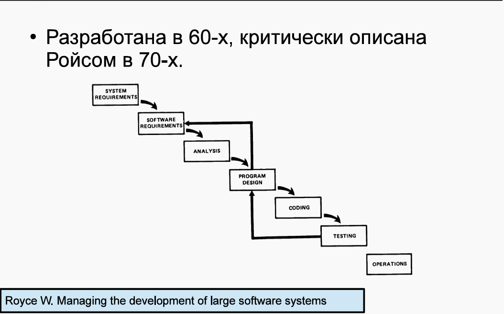

Имеется возможность отката к предыдущей стадии разработки. Чем раньше фаза была, тем сложнее вернуться.

3. Методология Ройса

В этой методологии Ройс предлагает расширять водопадную 5 дополнительными шагами.
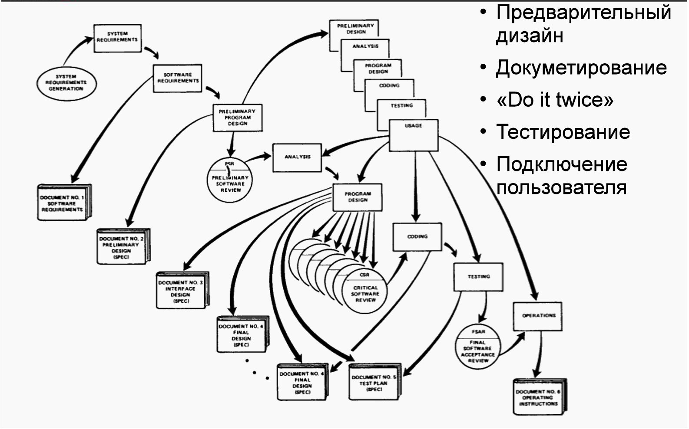

- Первый шаг - дизайн программы. Не будет давать полной картины. Формируются модели обработки данных. Делает дизайнер, а
  не аналитики\программисты.
- Второй шаг - создание документации: требования к системе, спецификация дизайна, план тестирования и тд.
- Третий шаг - тестовая разработка (упрощенная версия). Подтверждает или опровергает характеристики ПО.
- Четвертый шаг - планирование, контроль тестирования (самая сложная и рискованная фаза). Здесь формируются
  альтернативы, вносятся изменения. После повторное тестирование.
- Пятый шаг - подключение пользователя. Получение его мнения, оценки.

4. Традиционная V-chart model J.Munson, B.Boehm

Предложена Барри Боемом и Джеком Мансоном. Как и многие другие, фокусируется на качестве ПО и тестированию.

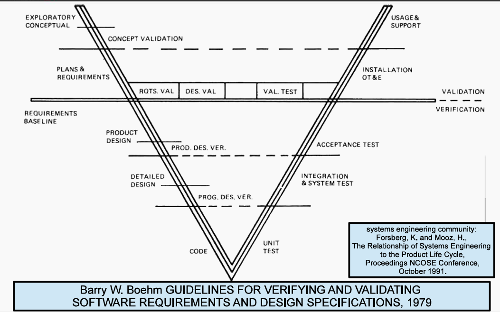

В основе - водопадная модель, но на каждом шаге тестирование на основании критериев верификации. Последний этап -
приемочное тестирование (проверка соответсвия продукта функциональным требованиям, далее ФТ).
Для проведения тестирования необходимо сначала определить поведение. Цель тестирования - определить соответствие
программы
эталону.

5. Многопроходная модель (Incremental model)

Разбиение создания продуктов на отдельные этапы и требования, после чего проектировать и интегрировать в несколько
проходов в виде отдельных сборок.

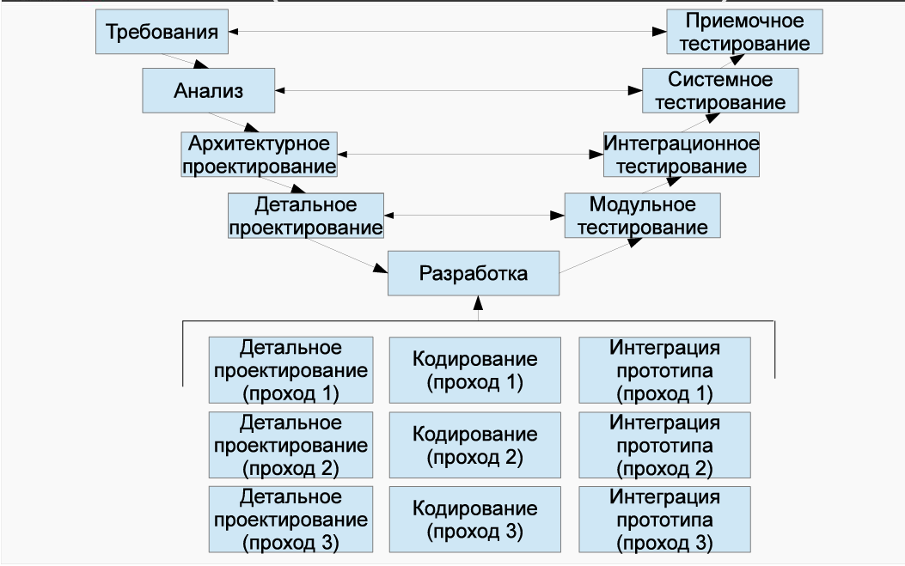

Позволяет снизить стоимость изменения требований. Разработка прозрачная для заказчика. Agile опирается на такой подход.

Основной недостаток - архитектура устаревает и деградирует. Это требует рефакторинга. Большие системы опираются на
стабильные, неизменяемые системы, сложно сделать качественно с начала. Так же сложно управлять проектом (высокая
скорость изменений).

Заключение контрактов - проблема, тк сложно учесть изменения и рассчитать оплату.

6. Модель прототипирования (80-е)

Основная идея - создание прототипов, уточняющих архитектуру в рамках ФТ, ПО постоянно эволюционирует.

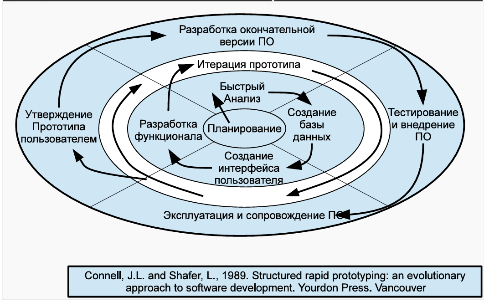

Планируется итерация, анализ требований. Создается БД, UI, функционал. Проверяется с пользователем системы.

Если пользователь удовлетворен, то переход к разработке финальной версии ПО.

Иначе создается новый прототип (без части функционала, экономия), показываются пользователю изменения. Так продолжается,
пока не будет получена система,
которую согласовал клиент.

В современных методах используются различные средства макетирования.

7. RAD методология

Увеличение участия пользователя в разработке.

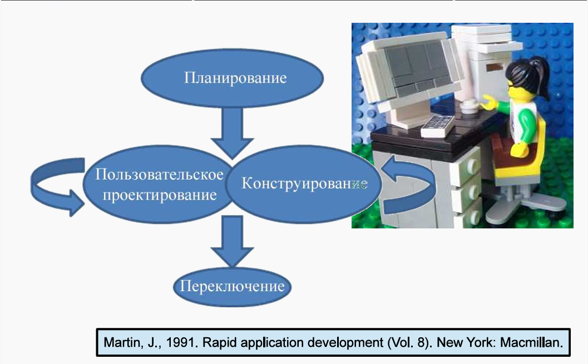

Предпосылки RAD - средства автоматизации и разработки.

Раньше не было средств автоматизации, создание программ было сложным. Методология учитывает их использование, а так же
привлечение пользователя в разработку. Благодаря этому пользователь может самостоятельно проектировать бизнес-функции.

8. Спиральная модель

Каждый виток - фаза разработки продукта для новой версии ПО\прототипа. Сначала формируются цели, альтернативы,
ограничения.

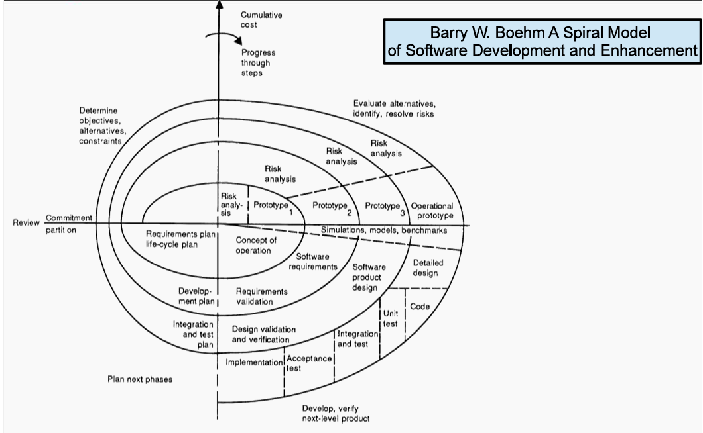

После формирования целей проводится анализ рисков. На каждой итерацией перед созданием прототипа сверка с картой
рисков (все риски).
После анализа - разработка и проверка полученной версии ПО.
В конце последней итерации - тестирование, аналогичное V-образной модели.

Изменения - неотъемлемая часть разработки. Могут быть отклонены, приняты или проигнорированы в зависимости от рисков.

9. UML Диаграммы: Структурные и поведенческие

UML диаграммы упрощают передачу и восприятие информации. Частые сценарии использования:

- Варианты использования. Описывает высокоуровневые требования
- Классы. На уровне анализа: описание предметной области без деталей; на уровне проектирования: для иллюстрации
  механизмов с деталями
- Деятельность, последовательность, состояния. Определяют логику и последовательность алгоритмов, взаимодействия.
- Размещение. Описывает архитектуру системы с деталями связи компонентов.

Структурные сущности UML - "объекты" на диаграмме:

- Объект - сущность. Обладает уникальностью, инкапсулирует состояние и поведение.
- Класс - описывает множество объектов с общими атрибутами или операциями (ООП).
- Интерфейс - множество операций под именем.
- Кооперация - совокупность взаимодействующих объектов (для достижения цели).
- Действующее лицо (актор) - внешняя сущность, инициирует взаимодействие с системой.
- Артефакт - модуль системы. Требуемые и предоставляемые интерфейсы определены.
- Улез - вычислительный ресурс. На нем размещены компоненты и артефакты.

Поведенческие сущности UML:

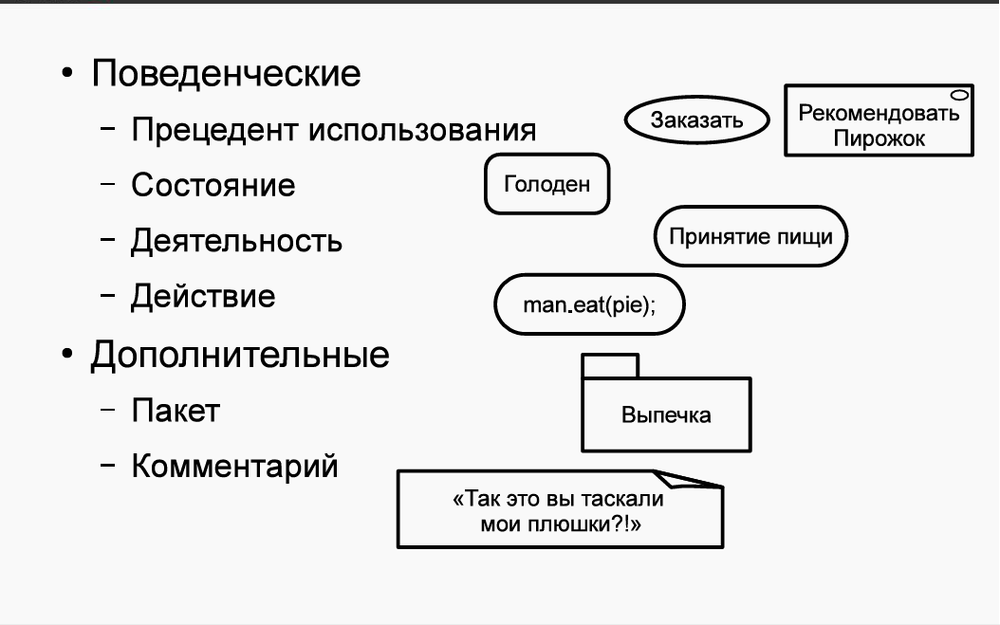

- Прецедент\вариант использования\use case - сущность, определяющая действие (набор) использования системы внешним
  актором.
- Состояние - период в общем времени жизни объекта, характеризующийся уникальным и различным набором значимых атрибутов
  объекта.
- Деятельность - обледененное в логически значимое для предметной области множество действий. Действие здесь - просто
  вычисление.

10. UML: Use-case модель

# TODO

11. UML: Диаграмма классов

Диаграмма классов (доменная модель) описывает предметную область.

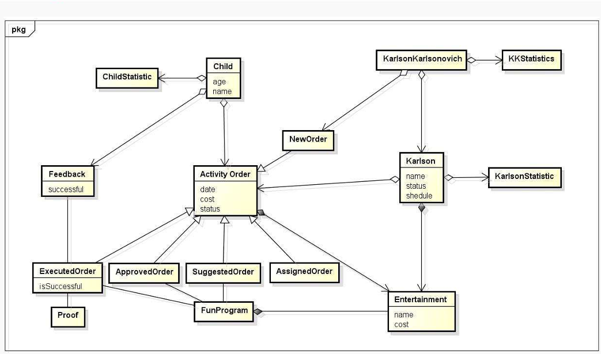

12. UML: Диаграмма последовательностей

Диаграмма последовательностей (состояний) - диаграмма конечных автоматов.

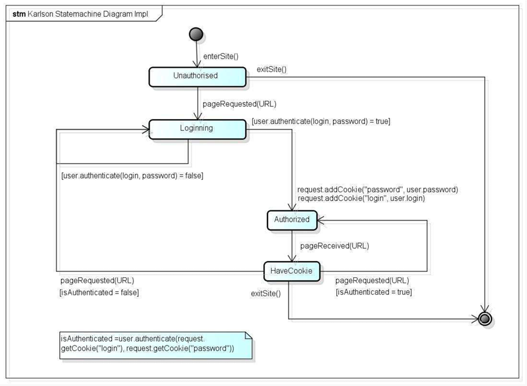

На примере детализация уровня реализации кода. Отражает состояние аутентификации и авторизации.

13. UML: Диаграмма размещения.

Диаграмма размещения показывает физическую архитектуру размещения частей приложения на серверах.

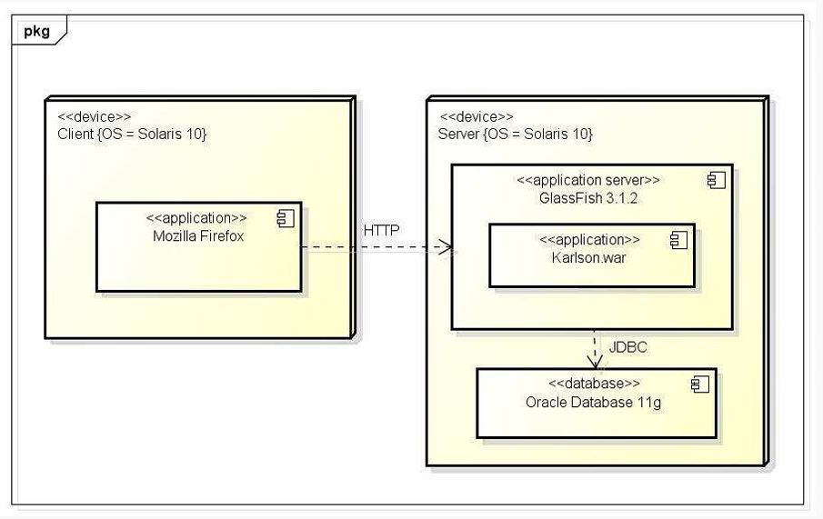

15. *UP методологии (90-е)

В основе - ООП, различные методики ООП

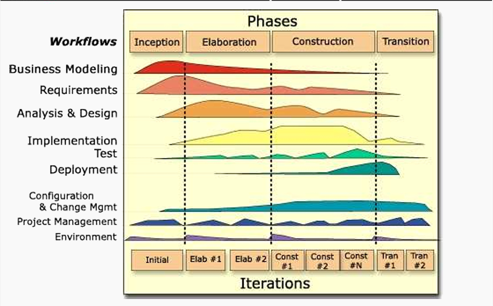

Разработка - инкрементно-эволюционный процесс. Весь процесс разбит на фазы и дисциплины.
Дисциплины - набор правил и указаний, необходимых для решения определенной задачи.

Дисциплины нужны для организации разработчиков, чтобы каждая роль могла выполнить требуемые действия.

15. RUP: основы процесса

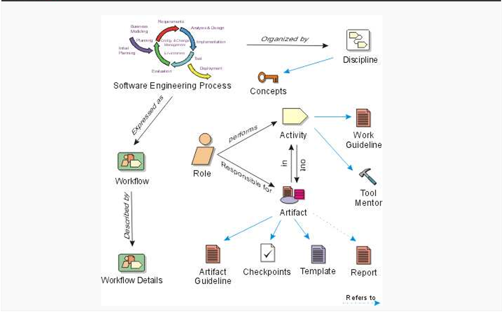

- Роль - группа обязанностей участника для выполнения повседневной деятельности.
- Роли соответствует набор деятельностей. На входе и выходе деятельности используются\создаются\модифицируются
  артефакты.
- Артефакт - результат труда роли. Создаются на основе шаблонов и инструкций.
- Деятельность - набор действий, выполняемых ролью. Определен правилами и средствами компании.

В отличие от других моделей ЖЦ и методов, в RUP каждый элемент процесса детально описан и связан с другим (набор
связанных веб страниц, каждая описывает элемент процесса разработки).

Любая фаза заканчивается вехами. Веха - момент принятия решения о дальнейших действиях:
переход на следующую фазу или проведение дополнительных работ. Решения о переходе принимают заинтересованные стороны -
stakeholders.

Стейкхолдеры - лица, материально заинтересованные в создании ПО (инвесторы, руководство заказчика и разработчика). Они
хотят создать продукт и получить с этого прибыль в той или иной форме.

16. RUP: Фаза «Начало»

Основа фазы - оценить проект, требуемые ресурсы, время, понять проблемы пользователей и как их решить.

### слайд 22

Цели:

- Определить границы проекта, область применения разрабатываемого ПО
- Разработать и описать основные сценарии использования.
- Предложить возможные технические решения
- Расчет стоимости и графика работ
- Оценка рисков, подготовка окружения

На вехе "Lifecycle Objects" заинтересованные лица пришли к согласию в оценке сроков, стоимости, требованиях, технологиях
и тд.

17. RUP: Фаза «Проектирование»

Основа фазы - разработка и тестирование стабильной и неизменяемой архитектуры системы, а так же создание прототипов.

### слайд 23

Цели:

- Финализация архитектуры
- Разработка прототипов и их тестирование
- Убедиться, что архитектура, сроки стабильны, риски учтены
- Продемонстрировать, что в архитектуре можно реализовать требования с разумной стоимостью и сроками

Исполняемая архитектура - несколько характерных функций системы, они полностью закончены на базе выбранных технологий.
Объем определяется на основе внесения новых архитектурных элементов требованием. Как только элементы перестают
добавляться-архитектура готова.

На вехе "Lifecycle Architecture" проверяется, возможна ли реализация с учетом заложенной стоимости и сроков. Контроль
потраченных ресурсов. Возможен аргументированный перерасход средств.

18. RUP: Фаза «Построение»

Основа фазы - экономически эффективно и качественно, максимально быстро разработать продукт.

### слайд 24

Цели:

- Экономически эффективно, качественно, быстро разработать продукт
- Итеративный и инкрементный анализ, разработка, тестирование продукта
- Подготовить продукт, платформу, пользователей к использованию

На вехе "Initial Operational Capability" принимается решения о возможности внедрения продукта на стороне заказчика.
Необходимо учитывать стабильность продукта, готовность пользователей. Так же еще раз проверяется отношение реальных и
плановых затрат.

19. RUP: Фаза «Внедрение»

Основа фазы - запуска продукта в использование и подтверждение пользователем пригодности продукта.

### слайд 25

Цели:

- Бета-тестирование, сравнить версии
- Перенести БД, обучить пользователей, обслуживающий персонал
- Запустить продажи
- Отладить устранение сбоев
- Убедиться в самодостаточности пользователей
- Провести анализ соответствия продукта исходной концепции

На вехе "Product Release" вопрос - удовлетворен ли пользователь? Проводится работа над ошибками, сверка затрат с
предполагаемыми для коррекции будущих проектов.

20. Манифест Agile (2001)
21. Scrum
22. Disciplined Agile 2.X (2013)
23. Требования. Иерархия требований
24. Свойства и типы требований (FURPS+)
25. Формулирование требований. Функциональные требования
26. Требования к удобству использования и надежности
27. Требования к производительности и поддерживаем ости
28. Атрибуты требований
29. Описание прецедента
30. Риски. Типы Рисков
31. Управления рисками. Деятельности, связанные с оценкой
32. Управления рисками. Деятельности, связанные контролем и управлением
33. Изменение. Общая модель управления изменениями
34. Системы контроля версий. Одновременная модификация файлов
35. Subversion. Архитектура системы и репозиторий
36. Subversion: Основной цикл разработчика. Команды
37. Subversion: Конфликты.Слияние изменений
38. GIT: Архитектура и команды
39. GIT: Организация ветвей репозитория
40. GIT: Плагин git-flow
41. Системы автоматической сборки: предпосылки появления
42. Системы сборки: Make и Makefile
43. Системы сборки: Ant. Команды Ant
44. Системы сборки: Ant-ivy
45. Системы сборки: Maven.POM. Репозитории и зависимости
46. Maven: Структура проекта.GAV
47. Maven: Зависимости.Жизненный цикл сборки.Плагины
48. Системы сборки: Maven.POM. Репозитории и зависимости
49. Системы сборки: GNU autotools. Создание конфигурации проекта
50. Системы сборки: GNU autotools. Конфигурация и сборка проекта
51. Сервера сборки/непрерывной интеграции
52. Основные понятия тестирования. Цели тестирования
53. Понятие полного тестового покрытия и его достижимости. Пример
54. Статическое и динамическое тестирование
55. Автоматизация тестов и ручное тестирование
56. Источники данных для тестирования. Роли и деятельности в тестировании
57. Понятие тестового случая и сценария
58. Выбор тестового покрытия и количества тестов. Анализ эквивалентности
59. Модульное тестирование. Junit 4
60. Интеграционное тестирование. Стратегии интеграции
61. Функциональное тестирование. Selenium
62. Техники статического тестирования. Статический анализ кода
63. Тестирование системы в целом. Системное тестирование. Тестирование производительности
64. Тестирование системы в целом. Альфа- и бета-тестирование
65. Аспекты быстродействия системы. Влияние средств измерения на результаты
66. Ключевые характеристики производительности
67. Нисходящий метод поиска узких мест
68. Пирамида памяти и ее влияние на производительность
69. Мониторинг производительности: процессы
70. Мониторинг производительности: виртуальная память
71. Мониторинг производительности: буферизированный файловый ввод-вывод
72. Мониторинг производительности: Windows и Linux
73. Системный анализ Linux "за 60 секунд"
74. Создание тестовой нагрузки и нагрузчики
75. Профилирование приложений. Основные подходы
76. Компромиссы (trade-offs) в производительности
77. Рецепты повышения производительности при высоком %SYS
78. Рецепты повышения производительности при высоком %IO wait
79. Рецепты повышения производительности при высоком %Idle
80. Рецепты повышения производительности при высоком %User.
