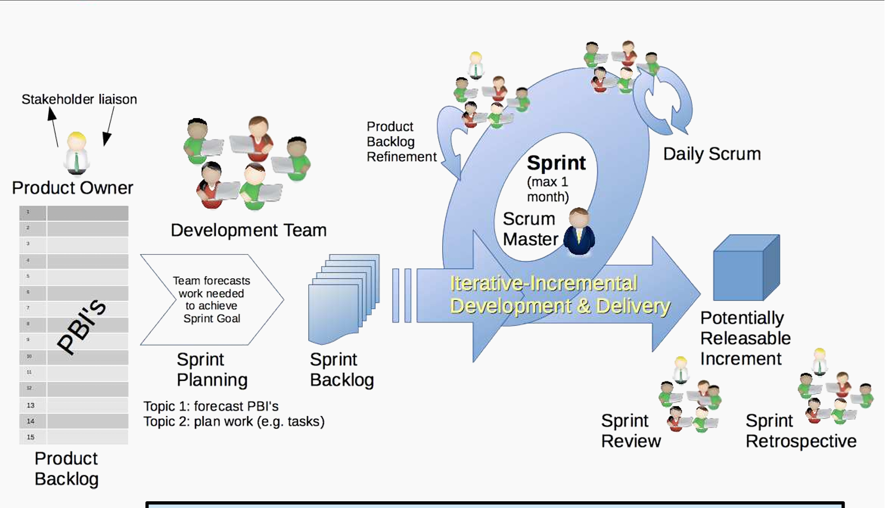
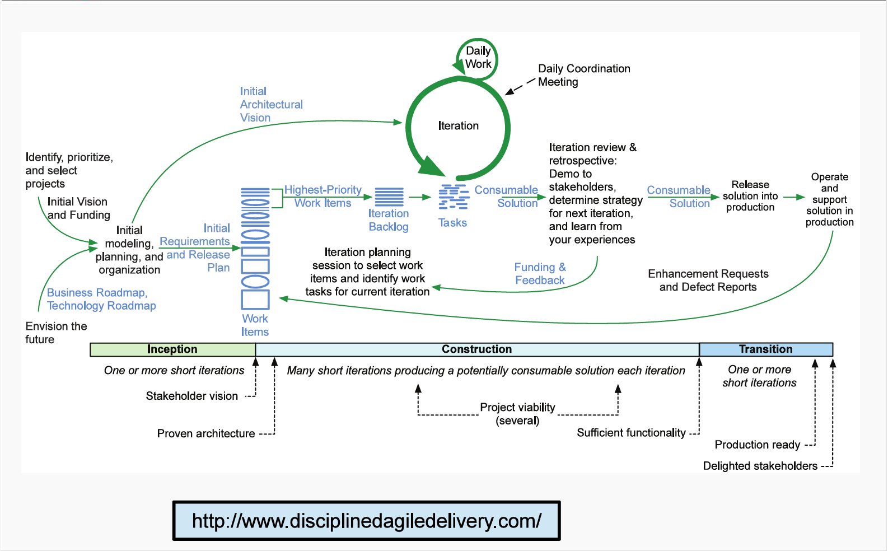
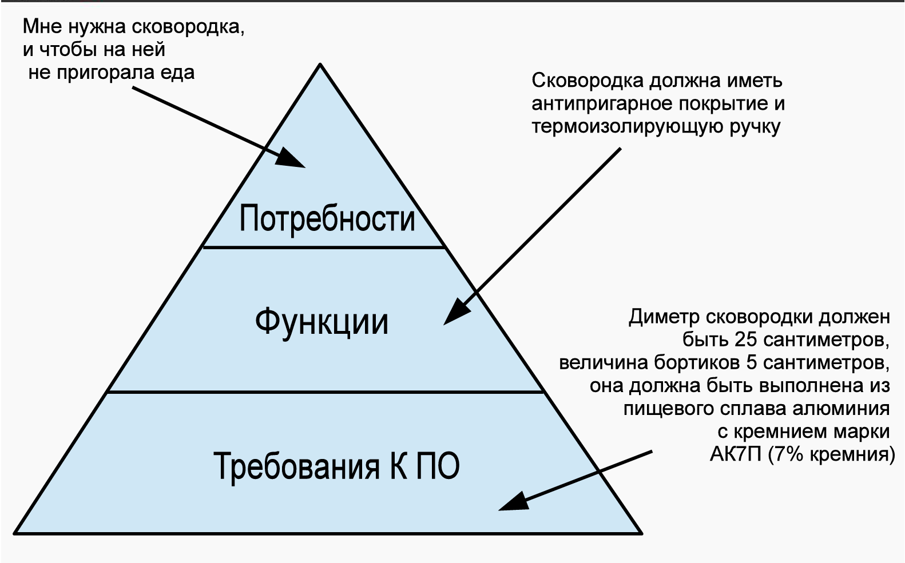
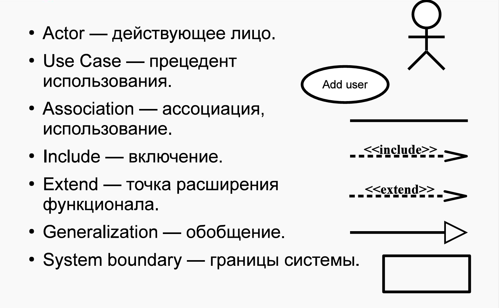
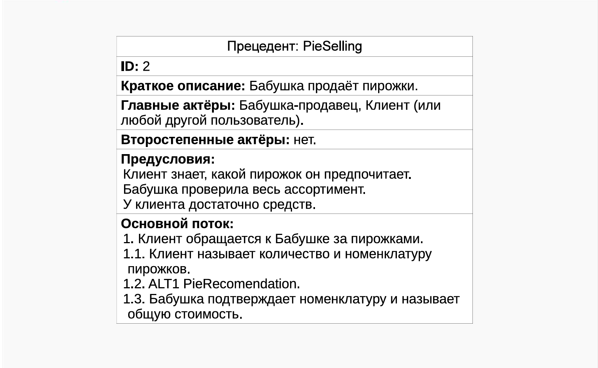
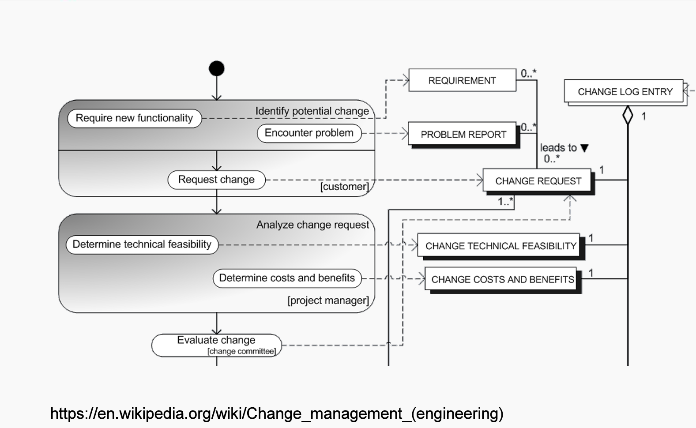
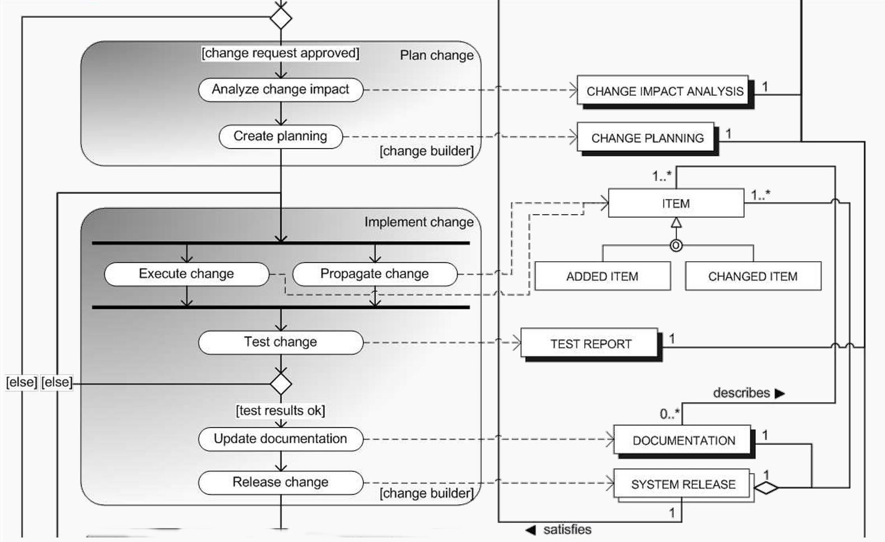
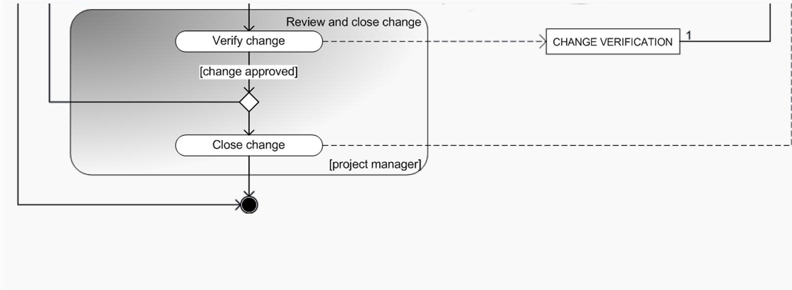
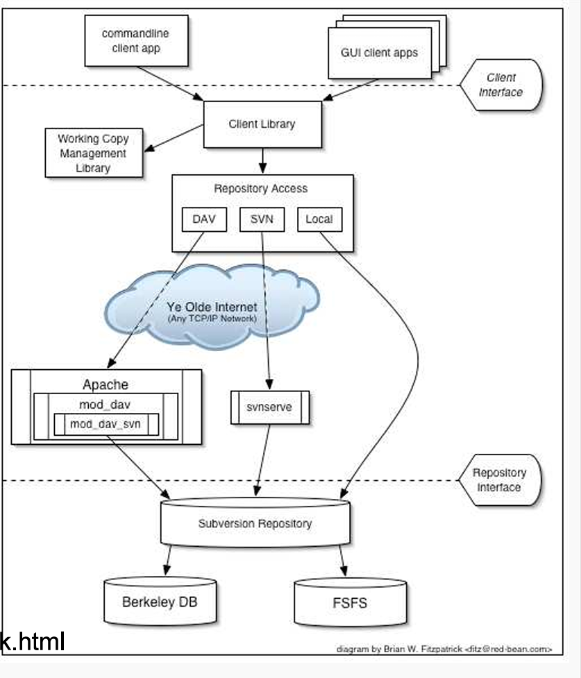
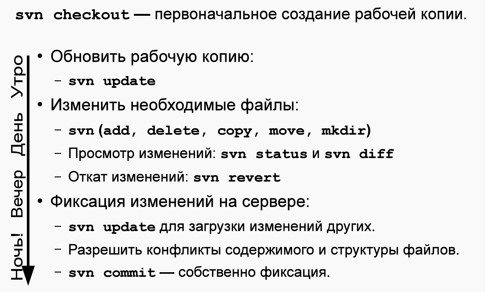

## Вопросы к экзамену ОПИ 2024

0. ISO/IEC 12207:2010: Жизненный цикл ПО. Группы процессов ЖЦ

ЖЦ - время от идеи до вывода из эксплуатации.

Основные этапы включают:

- Разработка требований (формирует заказчик и разработчик)
- Анализ (анализ требований, поиск способов решения)
- Проектирование (архитектуры и шаблонов ПО)
- Разработка
- Тестирование (параллельно разработке)
- Внедрение
- Эксплуатация
- Вывод из эксплуатации

Процесс ЖЦ определен: входные данные\ресурсы -> действия -> выходные данные\ресурсы

Группы процессов:

- Согласования
- Организационного обеспечения
- Проектов
- Тех процессов
- Реализации программных средств (далее ПС)
- Поддержки ПС
- Повторного использования ПС

1. Модели ЖЦ (последовательная, инкрементная, эволюционная)

Последовательная - все требования определены, один этап разработки

Инкрементная - все требования определены, несколько этапов разработки

Эволюционная - не все требования определены, несколько этапов разработки

Чаще всего используют инкрементно-эволюционную. Популярный подход - SCRUM - эволюционная модель с коротким циклом
производства.

2. Водопадная (каскадная) модель

Разработана в 60-х годах, описана Ройсом (но это не модель Ройса) в 70-х

Имеется возможность отката к предыдущей стадии разработки. Чем раньше фаза была, тем сложнее вернуться.

3. Методология Ройса

В этой методологии Ройс предлагает расширять водопадную 5 дополнительными шагами.

- Первый шаг - дизайн программы. Не будет давать полной картины. Формируются модели обработки данных. Делает дизайнер, а
  не аналитики\программисты.
- Второй шаг - создание документации: требования к системе, спецификация дизайна, план тестирования и тд.
- Третий шаг - тестовая разработка (упрощенная версия). Подтверждает или опровергает характеристики ПО.
- Четвертый шаг - планирование, контроль тестирования (самая сложная и рискованная фаза). Здесь формируются
  альтернативы, вносятся изменения. После повторное тестирование.
- Пятый шаг - подключение пользователя. Получение его мнения, оценки.

4. Традиционная V-chart model J.Munson, B.Boehm

Предложена Барри Боемом и Джеком Мансоном. Как и многие другие, фокусируется на качестве ПО и тестированию.

В основе - водопадная модель, но на каждом шаге тестирование на основании критериев верификации. Последний этап -
приемочное тестирование (проверка соответсвия продукта функциональным требованиям, далее ФТ).
Для проведения тестирования необходимо сначала определить поведение. Цель тестирования - определить соответствие
программы
эталону.

5. Многопроходная модель (Incremental model)

Разбиение создания продуктов на отдельные этапы и требования, после чего проектировать и интегрировать в несколько
проходов в виде отдельных сборок.

Позволяет снизить стоимость изменения требований. Разработка прозрачная для заказчика. Agile опирается на такой подход.

Основной недостаток - архитектура устаревает и деградирует. Это требует рефакторинга. Большие системы опираются на
стабильные, неизменяемые системы, сложно сделать качественно с начала. Так же сложно управлять проектом (высокая
скорость изменений).

Заключение контрактов - проблема, тк сложно учесть изменения и рассчитать оплату.

6. Модель прототипирования (80-е)

Основная идея - создание прототипов, уточняющих архитектуру в рамках ФТ, ПО постоянно эволюционирует.

Планируется итерация, анализ требований. Создается БД, UI, функционал. Проверяется с пользователем системы.

Если пользователь удовлетворен, то переход к разработке финальной версии ПО.

Иначе создается новый прототип (без части функционала, экономия), показываются пользователю изменения. Так продолжается,
пока не будет получена система,
которую согласовал клиент.

В современных методах используются различные средства макетирования.

7. RAD методология

Увеличение участия пользователя в разработке.

Предпосылки RAD - средства автоматизации и разработки.

Раньше не было средств автоматизации, создание программ было сложным. Методология учитывает их использование, а так же
привлечение пользователя в разработку. Благодаря этому пользователь может самостоятельно проектировать бизнес-функции.

8. Спиральная модель

Каждый виток - фаза разработки продукта для новой версии ПО\прототипа. Сначала формируются цели, альтернативы,
ограничения.

После формирования целей проводится анализ рисков. На каждой итерацией перед созданием прототипа сверка с картой
рисков (все риски).
После анализа - разработка и проверка полученной версии ПО.
В конце последней итерации - тестирование, аналогичное V-образной модели.

Изменения - неотъемлемая часть разработки. Могут быть отклонены, приняты или проигнорированы в зависимости от рисков.

9. UML Диаграммы: Структурные и поведенческие

UML диаграммы упрощают передачу и восприятие информации. Частые сценарии использования:

- Варианты использования. Описывает высокоуровневые требования
- Классы. На уровне анализа: описание предметной области без деталей; на уровне проектирования: для иллюстрации
  механизмов с деталями
- Деятельность, последовательность, состояния. Определяют логику и последовательность алгоритмов, взаимодействия.
- Размещение. Описывает архитектуру системы с деталями связи компонентов.

Структурные сущности UML - "объекты" на диаграмме:

- Объект - сущность. Обладает уникальностью, инкапсулирует состояние и поведение.
- Класс - описывает множество объектов с общими атрибутами или операциями (ООП).
- Интерфейс - множество операций под именем.
- Кооперация - совокупность взаимодействующих объектов (для достижения цели).
- Действующее лицо (актор) - внешняя сущность, инициирует взаимодействие с системой.
- Артефакт - модуль системы. Требуемые и предоставляемые интерфейсы определены.
- Улез - вычислительный ресурс. На нем размещены компоненты и артефакты.

Поведенческие сущности UML:

- Прецедент\вариант использования\use case - сущность, определяющая действие (набор) использования системы внешним
  актором.
- Состояние - период в общем времени жизни объекта, характеризующийся уникальным и различным набором значимых атрибутов
  объекта.
- Деятельность - обледененное в логически значимое для предметной области множество действий. Действие здесь - просто
  вычисление.

10. UML: Use-case модель

# TODO

11. UML: Диаграмма классов

Диаграмма классов (доменная модель) описывает предметную область.

12. UML: Диаграмма последовательностей

Диаграмма последовательностей (состояний) - диаграмма конечных автоматов.

На примере детализация уровня реализации кода. Отражает состояние аутентификации и авторизации.

13. UML: Диаграмма размещения.

Диаграмма размещения показывает физическую архитектуру размещения частей приложения на серверах.

15. *UP методологии (90-е)

В основе - ООП, различные методики ООП

Разработка - инкрементно-эволюционный процесс. Весь процесс разбит на фазы и дисциплины.
Дисциплины - набор правил и указаний, необходимых для решения определенной задачи.

Дисциплины нужны для организации разработчиков, чтобы каждая роль могла выполнить требуемые действия.

15. RUP: основы процесса

- Роль - группа обязанностей участника для выполнения повседневной деятельности.
- Роли соответствует набор деятельностей. На входе и выходе деятельности используются\создаются\модифицируются
  артефакты.
- Артефакт - результат труда роли. Создаются на основе шаблонов и инструкций.
- Деятельность - набор действий, выполняемых ролью. Определен правилами и средствами компании.

В отличие от других моделей ЖЦ и методов, в RUP каждый элемент процесса детально описан и связан с другим (набор
связанных веб страниц, каждая описывает элемент процесса разработки).

Любая фаза заканчивается вехами. Веха - момент принятия решения о дальнейших действиях:
переход на следующую фазу или проведение дополнительных работ. Решения о переходе принимают заинтересованные стороны -
stakeholders.

Стейкхолдеры - лица, материально заинтересованные в создании ПО (инвесторы, руководство заказчика и разработчика). Они
хотят создать продукт и получить с этого прибыль в той или иной форме.

16. RUP: Фаза «Начало»

Основа фазы - оценить проект, требуемые ресурсы, время, понять проблемы пользователей и как их решить.

### слайд 22

Цели:

- Определить границы проекта, область применения разрабатываемого ПО
- Разработать и описать основные сценарии использования.
- Предложить возможные технические решения
- Расчет стоимости и графика работ
- Оценка рисков, подготовка окружения

На вехе "Lifecycle Objects" заинтересованные лица пришли к согласию в оценке сроков, стоимости, требованиях, технологиях
и тд.

17. RUP: Фаза «Проектирование»

Основа фазы - разработка и тестирование стабильной и неизменяемой архитектуры системы, а так же создание прототипов.

### слайд 23

Цели:

- Финализация архитектуры
- Разработка прототипов и их тестирование
- Убедиться, что архитектура, сроки стабильны, риски учтены
- Продемонстрировать, что в архитектуре можно реализовать требования с разумной стоимостью и сроками

Исполняемая архитектура - несколько характерных функций системы, они полностью закончены на базе выбранных технологий.
Объем определяется на основе внесения новых архитектурных элементов требованием. Как только элементы перестают
добавляться-архитектура готова.

На вехе "Lifecycle Architecture" проверяется, возможна ли реализация с учетом заложенной стоимости и сроков. Контроль
потраченных ресурсов. Возможен аргументированный перерасход средств.

18. RUP: Фаза «Построение»

Основа фазы - экономически эффективно и качественно, максимально быстро разработать продукт.

### слайд 24

Цели:

- Экономически эффективно, качественно, быстро разработать продукт
- Итеративный и инкрементный анализ, разработка, тестирование продукта
- Подготовить продукт, платформу, пользователей к использованию

На вехе "Initial Operational Capability" принимается решения о возможности внедрения продукта на стороне заказчика.
Необходимо учитывать стабильность продукта, готовность пользователей. Так же еще раз проверяется отношение реальных и
плановых затрат.

19. RUP: Фаза «Внедрение»

Основа фазы - запуска продукта в использование и подтверждение пользователем пригодности продукта.

### слайд 25

Цели:

- Бета-тестирование, сравнить версии
- Перенести БД, обучить пользователей, обслуживающий персонал
- Запустить продажи
- Отладить устранение сбоев
- Убедиться в самодостаточности пользователей
- Провести анализ соответствия продукта исходной концепции

На вехе "Product Release" вопрос - удовлетворен ли пользователь? Проводится работа над ошибками, сверка затрат с
предполагаемыми для коррекции будущих проектов.

20. Манифест Agile (2001)

Требования и реакция заказчика важнее. Agile не работает при фиксированном бюджете.

### слайд 36

Agile хорошо работает для внутренних проектов компаний. Расходы на труд минимизированы (если это не создание кода)

- Люди и взаимодействие важнее процессов
- Работающий продукт важнее документации
- Сотрудничество с заказчиком важнее согласования условий контракта
- Готовность меняться важнее следования плану

Принципы Agile:

- Удовлетворение требований заказчика - ранняя и регулярная поставка ПО
- Изменение требований - хорошо, даже на поздних этапах
- Частые выпуски версий ПО
- Разработчики и заказчики ежедневно работают вместе
- Работают мотивированные профессионалы
- Непосредственное общение - самый эффективный подход обмена информацией
- Работающий продукт - показатель прогресса
- Постоянный ритм работы поддерживается бесконечно
- Внимание к совершенству и качеству ПО повывает гибкость
- Простота необходима (минимизация лишней работы)
- Самые лучшие требования и решения у самоорганизующихся команд
- Систематический анализ лучших альтернатив и коррекция стиля под них

21. Scrum

Процесс разработки упрощен. Единственный служебный артефакт - беклог - упорядоченный список требований с оценкой
трудоемкости.

Существуют беклоги продукта (бизнес требования, общий, беклог спринта).

Спринт - 2-4 недели на реализацию набора требований из беклога спринта. Каждый спринт заканчивается демо версией, она
демонстрируется заказчику.

Раз в несколько спринтов ретроспектива для перераспределения обязанностей и работы над ошибками.

Команда в Scrum - 3-10 человек+владелец продукта+скрам мастер. Владелец продукта определяет порядок разработки
требований из беклога (если заказчик-сам формулирует).
Скрам мастер проводит митинги, планирует спринт, контролирует поведение команды.

Scrum - просто, минимум доков, концентрация на рабочем коде. Подходит для небольшой команды. Масштабирование не
эффективно.

22. Disciplined Agile 2.X (2013)

Гибкие методологии сложно масштабировать на большие команды.

Присутствует деление на фазы (RUP), но основной цикл на базе Agile, Scrum.

Три фазы: начало, построение, внедрение. Расписаны процессы за рамками архитектуры:

- Управление архитектурой и повторным использованием кода
- Управление персоналом
- Служба поддержки

23. Требования. Иерархия требований

Требование - условия\возможности, которым должна соответствовать система. Требования подробно описывают, что должно быть
реализовано, но не описывают, как это реализовать.

Описываются с помощью SRS (RUP) и\или UseCase моделей. SRS - формально ТЗ.

Иерархия требований

Заинтересованные лица предоставляют в виде простых пожеланий. Так же предоставляются артефакты (для иллюстрации
информации).

Тут аналитикам важно перейти от общих требований к области решения и составить набор функций, которые реализуют
система.

24. Свойства и типы требований (FURPS+)

Требования должны быть:

- Корректными
- Однозначными
- Полными
- Непротиворечивыми
- Прописана приоритизация
- Проверяемыми
- Модифицируемыми
- Отслеживаемыми

Пример требования: **_id_** **_система_** должна **_требование_**

В RUP используется модель требований FURPS+:

- Функциональные требования - что система должна делать
- Нефункциональные требования - характеристики, ограничения:

    1. Usability - пользовательские характеристики

    2. Reliability - надежность системы

    3. Performance - производительность ПО

    4. Supportability - требования к возможностям и условиям поддержки ПО

25. Формулирование требований. Функциональные требования

Пример требования: **_id_** **_система_** должна **_требование_**

Функциональные требования включают: feature sets, capabilities, security

Features et - набор свойств ПО, необходимый для выполнения конкретной деятельности.

Security - описывают методы аутентификации, роли, шифрование и т д.

Capabilities - возможности системы по выполнению той или иной задачи.

26. Требования к удобству использования и надежности

Usability включает:

- Возможности и особенности пользователей
- Требования к интерфейсу (удобство, согласованной, эстетические требования)
- Системы настройки, пользовательские подсказки
- Документация и учебные материалы

Reliability включает:

- Частота отказов и их обработка
- Возможности системы по восстановлению функционала
- Предсказуемость поведения системы
- Точность (в том числе расчетов)
- Среднее время между отказами

27. Требования к производительности и поддерживаемости

Performance включает:

- Скорость выполнения задач (в основном вычислительных)
- Эффективность (время полезных задач к общесистемным задачам)
- Доступность системы
- Пропускная способность
- Время отклика
- Время восстановление
- Загрузка ресурсов

Supportability включает:

- Расширяемость
- Адаптируемость
- Maintainability
- Совместимость
- Конфигурируемость
- Обслуживаемость
- Возможность установки на разные системы
- Локализация

28. Атрибуты требований

Приоритет задается с помощью MoSCoW:

- Must have
- Should have
- Could have
- Wont have

Атрибуты:

- Статус: предложено, одобрено, отклонено и т д
- Трудоемкость: человеко-часы или иные поинты для расчеты
- Риск
- Стабильность - частоты изменения
- Целевая версия

29. Описание прецедента

Пример

Для разработки диаграммы прецедентов используется только начальная модель.

Extend как альтернативный сценарий.

30. Риски. Типы Рисков

Риск - потенциально опасный для проекта фактор.

Типы рисков:

- Прямые или непрямые - можем ли мы ими управлять или нет
- Ресурсные - недостаток людей, времени, денег. Являются управляемыми
- Бизнес-риски - появляются из-за взаимодействия с другими организациями или рынком. Определены конкуренцией,
  подрядчиками, убыточными решениями. Являются управляемыми
- Технические риски - зависят от разработчиков. Являются управляемыми
- Политические риски - изменение сфер влияния внутри компании-заказчика. Не всегда можно предвидеть.
- Форс-мажоры - на них нельзя повлиять или предугадать

31. Управления рисками. Деятельности, связанные с оценкой

Управление рисками включает оценку и их контроль.

В процессе оценки происходит знакомство с риском, его анализ, степень серьезности, готовится план. После этого риск
отдается на контроль.

Идентификация риска по классам:

- Разработка
- Окружение
- Ограничения ПО

Риски могут быть известными и неизвестными. Известные риски просто идентифицировать, найти место возникновения. У
неизвестных рисков места можно предположить.

После идентификации риска проводится его анализ:

- Вероятность наступления
- Масштаб потерь

Эти параметры обычно задаются нечетко.

Планирование реакции (способы реагирования):

- Пытаемся избежать
- Пытаемся перенести
- Сокращаем вероятность появления
- Сталкиваемся с риском

32. Управления рисками. Деятельности, связанные контролем и управлением

Для избежания риска:

- Построение большого числа прототипов. Приближает правильную оценку системы заказчиком. Больше прототипов - меньше
  вероятность наступления рисков. Давит на бюджет и объем работ.
- Построение моделей, симуляция.
- Аналитика рабочего процесса, работа над ошибками этого\предыдущих проектов.
- Подбор персонала для решения конкретных задач.

Мониторинг рисков требует непрерывной переоценки. Полный список рисков может быть большим - контролируем 10 самых
вероятных и опасных. Так же полезно использовать системы контроля рисками и управления задачами разработчиков.

33. Изменение. Общая модель управления изменениями

### Изменения

У сложных проектов много людей, изменения нарастают очень быстро. Этим занимается дисциплина управления изменениями.

В больших системах сложно менять системы в нескольких местах сразу - последовательность действий. Системы контроля
версий (далее СКВ) - журналы учеты изменения. Управляются изменения не только кода, но и требований, дефектов, дизайна и
тд.

### Общая модель управления изменениями

Модель включает:

- Запрос и анализ:

Заказчик вносит изменения ради нового функционала и исправления проблем. Каждое изменение создает документ (Requirements
или Problem report). Оба документа формируют запрос на изменение, который потом добавляется в список.

После этого менеджер проекта определяет техническую необходимость и возможность, а так же формирует стоимость,
преимущества. На этой основе формируются Change Technical Feasibility или Change Costs and Benefits. Они добавляются в
журнал изменений.

После этого комитет по изменениям оценивает необходимость и стоимость и меняется статус в Change Request: принят,
отменен, отложен.

- Подтверждение и реализация:

После принятия решения об изменении проводится оценка влияния на пользователей и систему. После этого формируется
планирование проведения изменений (Create Planning): определяются ресурсы, время, график, действия для внесения
изменений.

После этого изменения реализуются, Change builder создает ряд объектов, описывающих изменения. После этого проводится
тестирование, изменяется документация и выпускается новая версия.

- Проверка и закрытие реализации:

Изменения передаются менеджеру (и\или заказчику), он их проверяет и утверждает.

34. Системы контроля версий. Одновременная модификация файлов

Управляют изменениями кода и поддерживают групповую работу.

Типы:

- На основе файловой системы (экспорт клиентам). Устаревший подход. Общая файловая система, отслеживание изменений
  только в ней.
- Централизованная (репозиторий на сервере). Репозиторий на одном сервер, клиенты по удаленному доступу. Например,
  Subversion.
- Распределенная (репозиторий у всех, на сервере центральное хранилище). У каждого пользователя копия данных с сервера (
  со
  всеми изменениями). После ряда локальных проверок изменения уходят на сервер. Git.

Существуют клиенты СКВ, доступны во многих IDE.

Существует два подхода одновременной модификации файлов:

- Lock-modify-unlock. Один работает над файлом, для остальных заблокирован. замедляет работу. Характерен для СКВ на
  файловых системах.
- Copy-modify-merger. Каждый копирует, модифицирует. Потом все сливают. Могут возникать конфликты слияния, выход -
  разрешение конфликтов.

35. Subversion. Архитектура системы и репозиторий

Архитектура:

2 реализации: в бд Berkeley DB или в файловой системе.

Доступом управляет демон svnserve (или Apache сервер, по сути та же логика).

Удаленный доступ осуществляется по svn, svn-https, ssh+svn.

Клиент SVN осуществляет передачу и управляет локальной копией (она может поменяться в зависимости от скачанной версии).

Репозиторий - набор файлов проекта, организуемых определенным иерархическим образом для работы над проектом.

В SVN каждый коммит поднимает версию репозитория на 1. Версия характеризует уникальный набор файлов в какой-то момент
времени.

Каждый коммит включает набор файлов, изменение которых необходимо поместить в репозиторий.

Основной процесс разработки находится в каталоге trunk. Разработчики вносят изменения в него. Возможно формирование до
каталогов branch и tags.

36. Subversion: Основной цикл разработчика. Команды

Основной цикл:

- Сервер содержит все последние изменения. Нужно скачать обновление локальной копии (svn update)
- Производится изменение файлов. svn add - добавить файл, svn delete - удалить файл, svn copy - скопировать файл.
- Если нужно откатиться, то используется svn revert.
- svn status и svn diff показывают изменения по сравнению с сервером.
- В конце рабочего дня еще раз svn update. Возможны конфликты, они решаются. После этого фиксация изменений svn commit.

37. Subversion: Конфликты.Слияние изменений

### начиная со слайда 77

38. GIT: Архитектура и команды
39. GIT: Организация ветвей репозитория
40. GIT: Плагин git-flow
41. Системы автоматической сборки: предпосылки появления
42. Системы сборки: Make и Makefile
43. Системы сборки: Ant. Команды Ant
44. Системы сборки: Ant-ivy
45. Системы сборки: Maven.POM. Репозитории и зависимости
46. Maven: Структура проекта.GAV
47. Maven: Зависимости.Жизненный цикл сборки.Плагины
48. Системы сборки: Maven.POM. Репозитории и зависимости
49. Системы сборки: GNU autotools. Создание конфигурации проекта
50. Системы сборки: GNU autotools. Конфигурация и сборка проекта
51. Сервера сборки/непрерывной интеграции
52. Основные понятия тестирования. Цели тестирования
53. Понятие полного тестового покрытия и его достижимости. Пример
54. Статическое и динамическое тестирование
55. Автоматизация тестов и ручное тестирование
56. Источники данных для тестирования. Роли и деятельности в тестировании
57. Понятие тестового случая и сценария
58. Выбор тестового покрытия и количества тестов. Анализ эквивалентности
59. Модульное тестирование. Junit 4
60. Интеграционное тестирование. Стратегии интеграции
61. Функциональное тестирование. Selenium
62. Техники статического тестирования. Статический анализ кода
63. Тестирование системы в целом. Системное тестирование. Тестирование производительности
64. Тестирование системы в целом. Альфа- и бета-тестирование
65. Аспекты быстродействия системы. Влияние средств измерения на результаты
66. Ключевые характеристики производительности
67. Нисходящий метод поиска узких мест
68. Пирамида памяти и ее влияние на производительность
69. Мониторинг производительности: процессы
70. Мониторинг производительности: виртуальная память
71. Мониторинг производительности: буферизированный файловый ввод-вывод
72. Мониторинг производительности: Windows и Linux
73. Системный анализ Linux "за 60 секунд"
74. Создание тестовой нагрузки и нагрузчики
75. Профилирование приложений. Основные подходы
76. Компромиссы (trade-offs) в производительности
77. Рецепты повышения производительности при высоком %SYS
78. Рецепты повышения производительности при высоком %IO wait
79. Рецепты повышения производительности при высоком %Idle
80. Рецепты повышения производительности при высоком %User.
