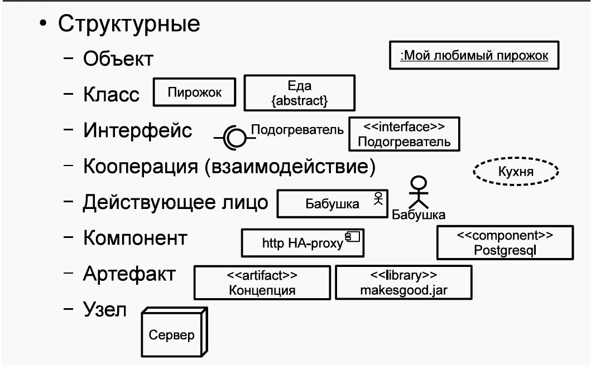
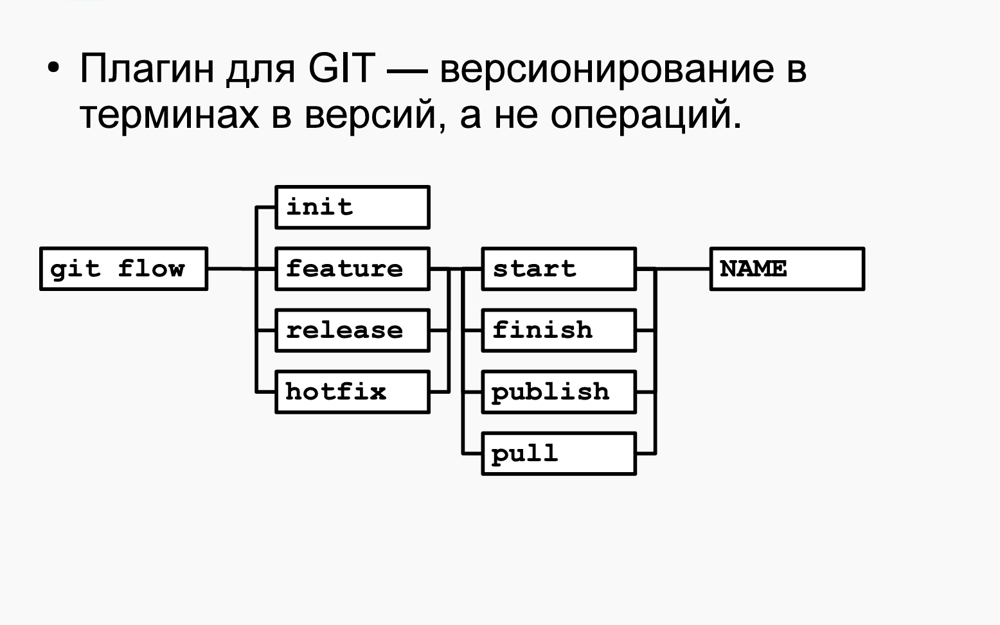

## Вопросы к экзамену ОПИ 2024

0. ISO/IEC 12207:2010: Жизненный цикл ПО. Группы процессов ЖЦ

ЖЦ - время от идеи до вывода из эксплуатации.

Основные этапы включают:

- Разработка требований (формирует заказчик и разработчик)
- Анализ (анализ требований, поиск способов решения)
- Проектирование (архитектуры и шаблонов ПО)
- Разработка
- Тестирование (параллельно разработке)
- Внедрение
- Эксплуатация
- Вывод из эксплуатации

Процесс ЖЦ определен: входные данные\ресурсы -> действия -> выходные данные\ресурсы

Группы процессов:

- Согласования
- Организационного обеспечения
- Проектов
- Тех процессов
- Реализации программных средств (далее ПС)
- Поддержки ПС
- Повторного использования ПС

1. Модели ЖЦ (последовательная, инкрементная, эволюционная)

Последовательная - все требования определены, один этап разработки

Инкрементная - все требования определены, несколько этапов разработки

Эволюционная - не все требования определены, несколько этапов разработки

Чаще всего используют инкрементно-эволюционную. Популярный подход - SCRUM - эволюционная модель с коротким циклом
производства.

2. Водопадная (каскадная) модель

Разработана в 60-х годах, описана Ройсом (но это не модель Ройса) в 70-х


Имеется возможность отката к предыдущей стадии разработки. Чем раньше фаза была, тем сложнее вернуться.

3. Методология Ройса

В этой методологии Ройс предлагает расширять водопадную 5 дополнительными шагами.


- Первый шаг - дизайн программы. Не будет давать полной картины. Формируются модели обработки данных. Делает дизайнер, а
  не аналитики\программисты.
- Второй шаг - создание документации: требования к системе, спецификация дизайна, план тестирования и тд.
- Третий шаг - тестовая разработка (упрощенная версия). Подтверждает или опровергает характеристики ПО.
- Четвертый шаг - планирование, контроль тестирования (самая сложная и рискованная фаза). Здесь формируются
  альтернативы, вносятся изменения. После повторное тестирование.
- Пятый шаг - подключение пользователя. Получение его мнения, оценки.

4. Традиционная V-chart model J.Munson, B.Boehm

Предложена Барри Боемом и Джеком Мансоном. Как и многие другие, фокусируется на качестве ПО и тестированию.


В основе - водопадная модель, но на каждом шаге тестирование на основании критериев верификации. Последний этап -
приемочное тестирование (проверка соответсвия продукта функциональным требованиям, далее ФТ).
Для проведения тестирования необходимо сначала определить поведение. Цель тестирования - определить соответствие
программы
эталону.

5. Многопроходная модель (Incremental model)

Разбиение создания продуктов на отдельные этапы и требования, после чего проектировать и интегрировать в несколько
проходов в виде отдельных сборок.


Позволяет снизить стоимость изменения требований. Разработка прозрачная для заказчика. Agile опирается на такой подход.

Основной недостаток - архитектура устаревает и деградирует. Это требует рефакторинга. Большие системы опираются на
стабильные, неизменяемые системы, сложно сделать качественно с начала. Так же сложно управлять проектом (высокая
скорость изменений).

Заключение контрактов - проблема, тк сложно учесть изменения и рассчитать оплату.

6. Модель прототипирования (80-е)

Основная идея - создание прототипов, уточняющих архитектуру в рамках ФТ, ПО постоянно эволюционирует.


Планируется итерация, анализ требований. Создается БД, UI, функционал. Проверяется с пользователем системы.

Если пользователь удовлетворен, то переход к разработке финальной версии ПО.

Иначе создается новый прототип (без части функционала, экономия), показываются пользователю изменения. Так продолжается,
пока не будет получена система,
которую согласовал клиент.

В современных методах используются различные средства макетирования.

7. RAD методология

Увеличение участия пользователя в разработке.


Предпосылки RAD - средства автоматизации и разработки.

Раньше не было средств автоматизации, создание программ было сложным. Методология учитывает их использование, а так же
привлечение пользователя в разработку. Благодаря этому пользователь может самостоятельно проектировать бизнес-функции.

8. Спиральная модель

Каждый виток - фаза разработки продукта для новой версии ПО\прототипа. Сначала формируются цели, альтернативы,
ограничения.


После формирования целей проводится анализ рисков. На каждой итерацией перед созданием прототипа сверка с картой
рисков (все риски).
После анализа - разработка и проверка полученной версии ПО.
В конце последней итерации - тестирование, аналогичное V-образной модели.

Изменения - неотъемлемая часть разработки. Могут быть отклонены, приняты или проигнорированы в зависимости от рисков.

9. UML Диаграммы: Структурные и поведенческие

UML диаграммы упрощают передачу и восприятие информации. Частые сценарии использования:

- Варианты использования. Описывает высокоуровневые требования
- Классы. На уровне анализа: описание предметной области без деталей; на уровне проектирования: для иллюстрации
  механизмов с деталями
- Деятельность, последовательность, состояния. Определяют логику и последовательность алгоритмов, взаимодействия.
- Размещение. Описывает архитектуру системы с деталями связи компонентов.

Структурные сущности UML - "объекты" на диаграмме:



- Объект - сущность. Обладает уникальностью, инкапсулирует состояние и поведение.
- Класс - описывает множество объектов с общими атрибутами или операциями (ООП).
- Интерфейс - множество операций под именем.
- Кооперация - совокупность взаимодействующих объектов (для достижения цели).
- Действующее лицо (актор) - внешняя сущность, инициирует взаимодействие с системой.
- Артефакт - модуль системы. Требуемые и предоставляемые интерфейсы определены.
- Улез - вычислительный ресурс. На нем размещены компоненты и артефакты.

Поведенческие сущности UML:


- Прецедент\вариант использования\use case - сущность, определяющая действие (набор) использования системы внешним
  актором.
- Состояние - период в общем времени жизни объекта, характеризующийся уникальным и различным набором значимых атрибутов
  объекта.
- Деятельность - обледененное в логически значимое для предметной области множество действий. Действие здесь - просто
  вычисление.


10. UML: Use-case модель

# TODO

11. UML: Диаграмма классов

Диаграмма классов (доменная модель) описывает предметную область.


12. UML: Диаграмма последовательностей

Диаграмма последовательностей (состояний) - диаграмма конечных автоматов.


На примере детализация уровня реализации кода. Отражает состояние аутентификации и авторизации.

13. UML: Диаграмма размещения.

Диаграмма размещения показывает физическую архитектуру размещения частей приложения на серверах.


15. *UP методологии (90-е)

В основе - ООП, различные методики ООП


Разработка - инкрементно-эволюционный процесс. Весь процесс разбит на фазы и дисциплины.
Дисциплины - набор правил и указаний, необходимых для решения определенной задачи.

Дисциплины нужны для организации разработчиков, чтобы каждая роль могла выполнить требуемые действия.

15. RUP: основы процесса


- Роль - группа обязанностей участника для выполнения повседневной деятельности.
- Роли соответствует набор деятельностей. На входе и выходе деятельности используются\создаются\модифицируются
  артефакты.
- Артефакт - результат труда роли. Создаются на основе шаблонов и инструкций.
- Деятельность - набор действий, выполняемых ролью. Определен правилами и средствами компании.

В отличие от других моделей ЖЦ и методов, в RUP каждый элемент процесса детально описан и связан с другим (набор
связанных веб страниц, каждая описывает элемент процесса разработки).

Любая фаза заканчивается вехами. Веха - момент принятия решения о дальнейших действиях:
переход на следующую фазу или проведение дополнительных работ. Решения о переходе принимают заинтересованные стороны -
stakeholders.

Стейкхолдеры - лица, материально заинтересованные в создании ПО (инвесторы, руководство заказчика и разработчика). Они
хотят создать продукт и получить с этого прибыль в той или иной форме.

16. RUP: Фаза «Начало»

Основа фазы - оценить проект, требуемые ресурсы, время, понять проблемы пользователей и как их решить.

### слайд 22

Цели:

- Определить границы проекта, область применения разрабатываемого ПО
- Разработать и описать основные сценарии использования.
- Предложить возможные технические решения
- Расчет стоимости и графика работ
- Оценка рисков, подготовка окружения

На вехе "Lifecycle Objects" заинтересованные лица пришли к согласию в оценке сроков, стоимости, требованиях, технологиях
и тд.

17. RUP: Фаза «Проектирование»

Основа фазы - разработка и тестирование стабильной и неизменяемой архитектуры системы, а так же создание прототипов.

### слайд 23

Цели:

- Финализация архитектуры
- Разработка прототипов и их тестирование
- Убедиться, что архитектура, сроки стабильны, риски учтены
- Продемонстрировать, что в архитектуре можно реализовать требования с разумной стоимостью и сроками

Исполняемая архитектура - несколько характерных функций системы, они полностью закончены на базе выбранных технологий.
Объем определяется на основе внесения новых архитектурных элементов требованием. Как только элементы перестают
добавляться-архитектура готова.

На вехе "Lifecycle Architecture" проверяется, возможна ли реализация с учетом заложенной стоимости и сроков. Контроль
потраченных ресурсов. Возможен аргументированный перерасход средств.

18. RUP: Фаза «Построение»

Основа фазы - экономически эффективно и качественно, максимально быстро разработать продукт.

### слайд 24

Цели:

- Экономически эффективно, качественно, быстро разработать продукт
- Итеративный и инкрементный анализ, разработка, тестирование продукта
- Подготовить продукт, платформу, пользователей к использованию

На вехе "Initial Operational Capability" принимается решения о возможности внедрения продукта на стороне заказчика.
Необходимо учитывать стабильность продукта, готовность пользователей. Так же еще раз проверяется отношение реальных и
плановых затрат.

19. RUP: Фаза «Внедрение»

Основа фазы - запуска продукта в использование и подтверждение пользователем пригодности продукта.

### слайд 25

Цели:

- Бета-тестирование, сравнить версии
- Перенести БД, обучить пользователей, обслуживающий персонал
- Запустить продажи
- Отладить устранение сбоев
- Убедиться в самодостаточности пользователей
- Провести анализ соответствия продукта исходной концепции

На вехе "Product Release" вопрос - удовлетворен ли пользователь? Проводится работа над ошибками, сверка затрат с
предполагаемыми для коррекции будущих проектов.

20. Манифест Agile (2001)

Требования и реакция заказчика важнее. Agile не работает при фиксированном бюджете.

### слайд 36

Agile хорошо работает для внутренних проектов компаний. Расходы на труд минимизированы (если это не создание кода)

- Люди и взаимодействие важнее процессов
- Работающий продукт важнее документации
- Сотрудничество с заказчиком важнее согласования условий контракта
- Готовность меняться важнее следования плану

Принципы Agile:

- Удовлетворение требований заказчика - ранняя и регулярная поставка ПО
- Изменение требований - хорошо, даже на поздних этапах
- Частые выпуски версий ПО
- Разработчики и заказчики ежедневно работают вместе
- Работают мотивированные профессионалы
- Непосредственное общение - самый эффективный подход обмена информацией
- Работающий продукт - показатель прогресса
- Постоянный ритм работы поддерживается бесконечно
- Внимание к совершенству и качеству ПО повывает гибкость
- Простота необходима (минимизация лишней работы)
- Самые лучшие требования и решения у самоорганизующихся команд
- Систематический анализ лучших альтернатив и коррекция стиля под них

21. Scrum

Процесс разработки упрощен. Единственный служебный артефакт - беклог - упорядоченный список требований с оценкой
трудоемкости.


Существуют беклоги продукта (бизнес требования, общий, беклог спринта).

Спринт - 2-4 недели на реализацию набора требований из беклога спринта. Каждый спринт заканчивается демо версией, она
демонстрируется заказчику.

Раз в несколько спринтов ретроспектива для перераспределения обязанностей и работы над ошибками.

Команда в Scrum - 3-10 человек+владелец продукта+скрам мастер. Владелец продукта определяет порядок разработки
требований из беклога (если заказчик-сам формулирует).
Скрам мастер проводит митинги, планирует спринт, контролирует поведение команды.

Scrum - просто, минимум доков, концентрация на рабочем коде. Подходит для небольшой команды. Масштабирование не
эффективно.

22. Disciplined Agile 2.X (2013)

Гибкие методологии сложно масштабировать на большие команды.


Присутствует деление на фазы (RUP), но основной цикл на базе Agile, Scrum.

Три фазы: начало, построение, внедрение. Расписаны процессы за рамками архитектуры:

- Управление архитектурой и повторным использованием кода
- Управление персоналом
- Служба поддержки

23. Требования. Иерархия требований

Требование - условия\возможности, которым должна соответствовать система. Требования подробно описывают, что должно быть
реализовано, но не описывают, как это реализовать.

Описываются с помощью SRS (RUP) и\или UseCase моделей. SRS - формально ТЗ.

Иерархия требований


Заинтересованные лица предоставляют в виде простых пожеланий. Так же предоставляются артефакты (для иллюстрации
информации).

Тут аналитикам важно перейти от общих требований к области решения и составить набор функций, которые реализуют
система.

24. Свойства и типы требований (FURPS+)

Требования должны быть:

- Корректными
- Однозначными
- Полными
- Непротиворечивыми
- Прописана приоритизация
- Проверяемыми
- Модифицируемыми
- Отслеживаемыми

Пример требования: **_id_** **_система_** должна **_требование_**

В RUP используется модель требований FURPS+:

- Функциональные требования - что система должна делать
- Нефункциональные требования - характеристики, ограничения:

    1. Usability - пользовательские характеристики

    2. Reliability - надежность системы

    3. Performance - производительность ПО

    4. Supportability - требования к возможностям и условиям поддержки ПО

25. Формулирование требований. Функциональные требования

Пример требования: **_id_** **_система_** должна **_требование_**

Функциональные требования включают: feature sets, capabilities, security

Features et - набор свойств ПО, необходимый для выполнения конкретной деятельности.

Security - описывают методы аутентификации, роли, шифрование и т д.

Capabilities - возможности системы по выполнению той или иной задачи.

26. Требования к удобству использования и надежности

Usability включает:

- Возможности и особенности пользователей
- Требования к интерфейсу (удобство, согласованной, эстетические требования)
- Системы настройки, пользовательские подсказки
- Документация и учебные материалы

Reliability включает:

- Частота отказов и их обработка
- Возможности системы по восстановлению функционала
- Предсказуемость поведения системы
- Точность (в том числе расчетов)
- Среднее время между отказами


27. Требования к производительности и поддерживаемости

Performance включает:

- Скорость выполнения задач (в основном вычислительных)
- Эффективность (время полезных задач к общесистемным задачам)
- Доступность системы
- Пропускная способность
- Время отклика
- Время восстановление
- Загрузка ресурсов

Supportability включает:

- Расширяемость
- Адаптируемость
- Maintainability
- Совместимость
- Конфигурируемость
- Обслуживаемость
- Возможность установки на разные системы
- Локализация

28. Атрибуты требований

Приоритет задается с помощью MoSCoW:

- Must have
- Should have
- Could have
- Wont have

Атрибуты:

- Статус: предложено, одобрено, отклонено и т д
- Трудоемкость: человеко-часы или иные поинты для расчеты
- Риск
- Стабильность - частоты изменения
- Целевая версия

29. Описание прецедента


Пример


Для разработки диаграммы прецедентов используется только начальная модель.

Extend как альтернативный сценарий.

30. Риски. Типы Рисков

Риск - потенциально опасный для проекта фактор.

Типы рисков:

- Прямые или непрямые - можем ли мы ими управлять или нет
- Ресурсные - недостаток людей, времени, денег. Являются управляемыми
- Бизнес-риски - появляются из-за взаимодействия с другими организациями или рынком. Определены конкуренцией,
  подрядчиками, убыточными решениями. Являются управляемыми
- Технические риски - зависят от разработчиков. Являются управляемыми
- Политические риски - изменение сфер влияния внутри компании-заказчика. Не всегда можно предвидеть.
- Форс-мажоры - на них нельзя повлиять или предугадать


31. Управления рисками. Деятельности, связанные с оценкой

Управление рисками включает оценку и их контроль.

В процессе оценки происходит знакомство с риском, его анализ, степень серьезности, готовится план. После этого риск
отдается на контроль.

Идентификация риска по классам:

- Разработка
- Окружение
- Ограничения ПО

Риски могут быть известными и неизвестными. Известные риски просто идентифицировать, найти место возникновения. У
неизвестных рисков места можно предположить.

После идентификации риска проводится его анализ:

- Вероятность наступления
- Масштаб потерь

Эти параметры обычно задаются нечетко.

Планирование реакции (способы реагирования):

- Пытаемся избежать
- Пытаемся перенести
- Сокращаем вероятность появления
- Сталкиваемся с риском

32. Управления рисками. Деятельности, связанные контролем и управлением

Для избежания риска:

- Построение большого числа прототипов. Приближает правильную оценку системы заказчиком. Больше прототипов - меньше
  вероятность наступления рисков. Давит на бюджет и объем работ.
- Построение моделей, симуляция.
- Аналитика рабочего процесса, работа над ошибками этого\предыдущих проектов.
- Подбор персонала для решения конкретных задач.

Мониторинг рисков требует непрерывной переоценки. Полный список рисков может быть большим - контролируем 10 самых
вероятных и опасных. Так же полезно использовать системы контроля рисками и управления задачами разработчиков.

33. Изменение. Общая модель управления изменениями

### Изменения

У сложных проектов много людей, изменения нарастают очень быстро. Этим занимается дисциплина управления изменениями.

В больших системах сложно менять системы в нескольких местах сразу - последовательность действий. Системы контроля
версий (далее СКВ) - журналы учеты изменения. Управляются изменения не только кода, но и требований, дефектов, дизайна и
тд.

### Общая модель управления изменениями

Модель включает:

- Запрос и анализ:


Заказчик вносит изменения ради нового функционала и исправления проблем. Каждое изменение создает документ (Requirements
или Problem report). Оба документа формируют запрос на изменение, который потом добавляется в список.

После этого менеджер проекта определяет техническую необходимость и возможность, а так же формирует стоимость,
преимущества. На этой основе формируются Change Technical Feasibility или Change Costs and Benefits. Они добавляются в
журнал изменений.

После этого комитет по изменениям оценивает необходимость и стоимость и меняется статус в Change Request: принят,
отменен, отложен.

- Подтверждение и реализация:


После принятия решения об изменении проводится оценка влияния на пользователей и систему. После этого формируется
планирование проведения изменений (Create Planning): определяются ресурсы, время, график, действия для внесения
изменений.

После этого изменения реализуются, Change builder создает ряд объектов, описывающих изменения. После этого проводится
тестирование, изменяется документация и выпускается новая версия.

- Проверка и закрытие реализации:


Изменения передаются менеджеру (и\или заказчику), он их проверяет и утверждает.

34. Системы контроля версий. Одновременная модификация файлов

Управляют изменениями кода и поддерживают групповую работу.

Типы:

- На основе файловой системы (экспорт клиентам). Устаревший подход. Общая файловая система, отслеживание изменений
  только в ней.
- Централизованная (репозиторий на сервере). Репозиторий на одном сервер, клиенты по удаленному доступу. Например,
  Subversion.
- Распределенная (репозиторий у всех, на сервере центральное хранилище). У каждого пользователя копия данных с сервера (
  со
  всеми изменениями). После ряда локальных проверок изменения уходят на сервер. Git.

Существуют клиенты СКВ, доступны во многих IDE.

Существует два подхода одновременной модификации файлов:

- Lock-modify-unlock. Один работает над файлом, для остальных заблокирован. замедляет работу. Характерен для СКВ на
  файловых системах.
- Copy-modify-merger. Каждый копирует, модифицирует. Потом все сливают. Могут возникать конфликты слияния, выход -
  разрешение конфликтов.


35. Subversion. Архитектура системы и репозиторий

Архитектура:


2 реализации: в бд Berkeley DB или в файловой системе.

Доступом управляет демон svnserve (или Apache сервер, по сути та же логика).

Удаленный доступ осуществляется по svn, svn-https, ssh+svn.

Клиент SVN осуществляет передачу и управляет локальной копией (она может поменяться в зависимости от скачанной версии).

Репозиторий - набор файлов проекта, организуемых определенным иерархическим образом для работы над проектом.

В SVN каждый коммит поднимает версию репозитория на 1. Версия характеризует уникальный набор файлов в какой-то момент
времени.

Каждый коммит включает набор файлов, изменение которых необходимо поместить в репозиторий.

Основной процесс разработки находится в каталоге trunk. Разработчики вносят изменения в него. Возможно формирование до
каталогов branch и tags.

36. Subversion: Основной цикл разработчика. Команды

Основной цикл:


- Сервер содержит все последние изменения. Нужно скачать обновление локальной копии (svn update)
- Производится изменение файлов. svn add - добавить файл, svn delete - удалить файл, svn copy - скопировать файл.
- Если нужно откатиться, то используется svn revert.
- svn status и svn diff показывают изменения по сравнению с сервером.
- В конце рабочего дня еще раз svn update. Возможны конфликты, они решаются. После этого фиксация изменений svn commit.


37. Subversion: Конфликты.Слияние изменений

Конфликты возникают, когда 2+ разработчика изменяют одну и ту же строку в файле. В случае возникновения конфликтов нужно
найти ответственного разработчика и согласовать решение с ним.

Способы решения конфликтов:


Для сравнения файлов можно использовать diff.

Так же существуют конфликты структуры. Происходят, когда файлы перемещаются и одновременно изменяются. Один из способов
решения-изменить локальную структуру, чтобы она соответствовала той, что находится в репозитории.

Для слияния изменения используется команда svn merge. Она загружает изменения из веток в рабочую копию trunk.


38. GIT: Архитектура и команды

GIT - децентрализованная СКВ. Репозитории есть локально у каждого разработчика. Причем каждая копия репозитория хранит
всю историю изменений. Когда разработчик создал какую то фичу, он отправляет ее остальных разработчикам, а те принимают
или не принимают ее (локальные репозитории доступны по URL\alias).

Существует 3 основных процесса работы с git:

- Централизованный процесс - центральный репозиторий, разработчики синхронизируются с ним.
- Рабочий процесс + менеджер по интеграции - разработчик вносит изменения, менеджер проверяет их и загружает на
  центральный репозиторий.
- Рабочий процесс + диктатор и лейтенанты - много участников. Лейтенанты - интеграционные менеджеры по разным частям
  репозитория. Диктатор - интеграционный менеджер, управляющий лейтенантами. Репозиторий диктатора - эталонный.


39. GIT: Организация ветвей репозитория

Модель изменений в git: каждое изменение в отдельной ветке.


В master\main находятся проверенные, работоспособные версии. Функционал определен, баги известны.

В develop идет разработка. Использует master, как базовую. После разработки фичи создается ветвь feature. После этого
код из нее переносится в develop.

Когда в develop накопилось много изменений, выпускается новая версия в ветку release. В этой ветке проводятся
исправления перед выходом новой версии. После исправления продукт копируется в master и мерджится в develop.

40. GIT: Плагин git-flow

Каждое действие над рабочий копией требует большого количества команд. git flow позволяет работать без знания команд в
терминах версий, а не операций.
git flow init проводит необходимую настройку. git flow feature start определяет начало разработки фичи, git flow feature
finish feature_name.



41. Системы автоматической сборки: предпосылки появления

В использовании ручной сборки существует много проблем:

- Большое количество одинаковых команд. Решение в виде скриптов сложно поддерживается, нужно каждый раз обновлять.
  вручную. Системы автосборки делают это автоматически.
- Отличие архитектуры систем: аппаратные отличия, отличия настройки ОС, особенности файловых систем.
- Медленная сборка.

Средства автоматической сборки:

- Специальные языки.
- Позволяют задать конфиг системы и автоматически определить архитектуру.
- Декларативная сборка.
- Параллельный и многомашинный режим работы.
- Интеграция с build серверами и тестами.


42. Системы сборки: Make и Makefile

Первый инструмент автоматической сборки (помимо скриптов). Опции и зависимости указываются в makefile.
Make позволяет определить последовательность сборки, а так же ее шаги. Содержит много переменных и сложно настраивается.

43. Системы сборки: Ant. Команды Ant

Apache Ant - утилита для сборки java программ. Императивная система сборки. Файл сборки - build.xml.


Цели можно вызвать в явном виде, а не через зависимости. Возможен вызов целей из других целей - можно делать модульную
систему сборки.

В build.xml присутствуют свойства с информацией о проекте. Могут задаваться: прямым значением, ссылкой на переменную
окружений или загружаться из файла.

Команды ant:

- checksum chmod, concat, copy, delete
- war, jar, tar, zip
- depend, javac
- serverdeploy, javadoc, ejb
- exec, java, sleep
- echo, mail, sql, tstamp
- cvs, vss
- junit, testlet

44. Системы сборки: Ant-ivy

Менеджер зависимостей для Ant. Без ivy каждую зависимость требовало собирать вручную и сохранять локально.
Ivy способен работать с репозиториями Maven2. Зависимости прописываются в файле ivy.xml.


45. Системы сборки: Maven.POM. Репозитории и зависимости

Maven - декларированный подход. Те же принципы, но пользователь указывает, что сделать, а не как.
Проект описывается в POM - Project Object Model (xml файл). В POM указаны имя, версия, тип программы, местонахождение
кода, зависимости, плагины и так далее.


46. Maven: Структура проекта.GAV

Структура проекта Maven:

- target - рабочая и целевая директории.
- src/main - основные исходные файлы.
- src/test - все, что связано с тестами.

Система наименования модулей по принципу GAV: groupId:artifactId:version. Так описывается любая внешняя зависимость.
Maven необходим доступ в интернет для скачивания зависимостей. Однако можно вручную это запретить, указав откуда брать
зависимости.

47. Maven: Зависимости.Жизненный цикл сборки.Плагины

В maven зависимости транзитивные (если подпроект зависит от набора библиотек, основной проект так же будет зависеть от
них), состоят из:

- GAV.
- Scope: compile, provided, runtime, test, system. Определяет, в какой момент ЖЦ применяется зависимость. По умолчанию -
  compile, зависимость подгружается при компиляции.
- Type: jar, pom, war, ear, zip.

Жизненный цикл Maven приложения:

- generate-sources/resources (авто генерируемые исходники)
- compile
- test-compile
- test
- package
- integration-test
- install (установка в локальном репозитории)
- deploy (установка на сервер)

Плагины:

- Все операции выполняются плагинами.
- Плагины содержат цели, связанные с ЖЦ:
    1. Core: clean compiler deploy...
    2. Packaging: ear ejb jar rar war...
    3. Reporting, Tools, etc

В Maven, в отличие от Ant, достаточно декларированный высказываний, а не прямых действий над приложениями.

48. Системы сборки: Maven.POM. Репозитории и зависимости

Повтор

49. Системы сборки: GNU autotools. Создание конфигурации проекта

GNU autotools работает на макропроцессоре. Макропроцессор - программа преобразования входного текста на основе правил
замены последовательности символов (макроподстановок). Макроподстановки подобны директивам препроцессора C.

GNU autotools используется для распространения опенсорс программ. Для сборки программы из исходников нужно знать 3
команды:

- ./configure
- make
- sudo make install

GNU autotools платформонезависмы.

Для создания конфигурации используется утилита autoscan. Она сканирует исходники и на основе имеющихся данных выделяет
платформозависимый код.
Потом генерируется configure.scan - конфиг файл. Он редактируется вручную, после чего создается configure.ac.
Makefile.am так же создается вручную. Содержит названия исполняемых программ, исходников и зависимостей.
После этого вызывается ряд команд для формирования шаблонов.

Когда все готово, вызывается automake и autoconf, в результате формируются Makefile.in и configure. Они определяют
конфиги
для целевой системы.


50. Системы сборки: GNU autotools. Конфигурация и сборка проекта

# TODO

### слайд 110-111

51. Сервера сборки/непрерывной интеграции

Сервер сборки/непрерывной интеграции:

- Автоматически собирает продукт при наступлении определенных условий.
- Предоставляет доступ к различным версиям продукта.
- Примеры: CruiseControl, Jenkins, Travis CI.

52. Основные понятия тестирования. Цели тестирования

Термины:

- Mistake - ошибка разработчика.
- Fault - дефект или изъян ПО. Следствие ошибки.
- Failure - отказ, сбой. Проявление дефекта.
- Error - Невозможность выполнения задачи из-за отказа.
- Bug - неформально, может обозначать все перечисленное.

Основные цели тестирования:

- Обнаружение дефектов.
- Повышение уверенности в уровне качества.
- Предоставление информации для принятия решений.
- Предотвращение дефектов.

Главной целью тестирования является повышение уровня пользовательского доверия к системе.

53. Понятие полного тестового покрытия и его достижимости. Пример

Тестовое покрытие - то, насколько код приложения покрыт тестами, которые способны находить изъяны или дефекты.

Полное покрытие подразумевает покрытие всего кода и всех возможных вариантов развития. Если и достижимо, то ценой
огромных затрат.

Например, для

``` java
public long multiply (int A, int B) {return a*b;}
```

Потребуется 2^64 операций, что примерно равно 181,5 года.

54. Статическое и динамическое тестирование

Статистическое тестирование (рецензирование):

- Не включает работу кода.
- Ручное, автоматическое.
- Неформальное, сквозной контроль, инспекция.

Когда кода нет, тестирование подразумевает проверку спецификаций, архитектурный принципов и т дю

Динамическое тестирование:

- Запуск модулей, групп модулей, всей системы.
- Обычно после появления первого кода (иногда Test-Driven Dev - сначала тесты, потом код).
-

55. Автоматизация тестов и ручное тестирование

Часто ручное тестирование дешевле и проще.

Автоматическое тестирование включает:

- Регрессионное тестирование - при изменении программы запускаются старые тесты.
- Повторение тестового сценария.
- Приемочное тестирование.
- Сокращение ручного труда (не всегда, иногда проще нанять дешевых тестеров, чем писать сложные тесты).
- Проверка в разных окружениях.


56. Источники данных для тестирования. Роли и деятельности в тестировании

Источники данных:

- Описание ПО - "черный ящик" (ПО скрыто), тесты создаются на уровне спецификации или на основе опыта тестировщика.
- Исходный код - "белый ящик" (исследование исходного кода). Метод дает оценить тестовое покрытие. На основе переходов,
  условий. Анализ структуры.
- Дополнительно - опыт разработчика, UML диаграммы.

Деятельность и роли:

- Проектирование тестов: на основании критериев, предметной области, опыта, особенностей UI и т д.
- Автоматизация тестов: знание средств, скриптов.
- Исполнение тестов: не требует особой квалификации. Персонал должен знать тестовую инфраструктуру.
- Анализ результатов: знание предметной области, технических особенностей.


57. Понятие тестового случая и сценария

Тестовый случай состоит из:

- Набора входных значений.
- Предусловий, условий, постусловий.
- Ожидаемых результатов (данные, состояния и т д). Определен до запуска теста (TDD).

Тестовый случай должен:

- Быть повторяемым и автоматизируемым.
- Учитывать состояния ПО, переходы между ними.
- Проверять нормальные сценарии, а так же сценарии, приводящие к ошибкам.

Тестовый сценарий - последовательность тестовых случаев.

Тестовый сценарий:

- Включает последовательность случаев (типичное использование системы).
- Обрабатывает корректное поведение и варианты ошибок.


58. Выбор тестового покрытия и количества тестов. Анализ эквивалентности

Требуется баланс в тестах:

- Много тестов - выше покрытие - выше качество - дороже.
- Меньше тестов - выше скорость - ниже качество - дешевле.
- Полное покрытие недостижимо.
- Нельзя тестировать вечно.

Методы определения достаточного тестового покрытия:

- Эквивалентное разбиение. Анализ граничных значений, внутри которых исследуемая функция ведет себя одинаково.
- Таблица решений (альтернатив). Составляется таблица, содержащая комбинации входных данных (и\или причин) с
  соответствующими выходными данными (и\или действиями).
- Таблица переходов. Вычисляются явные состояния внутри системы, переходы между ними, которые и покрываются тестами.
- Сценарии использования. В каждый сценарий из требований добавляются конкретные значения (учитываем основные и альт.
  пути).

Анализ эквивалентности:

- Тестируемая функция\модуль разбивается на участки, где программа ведет себя одинаково. Внутри каждого участка свои
  тесты. Отдельно тесты для граничных условий.


59. Модульное тестирование. Junit 4

Модульное тестирование - тестирование отдельных компонентов (модулей) ПО. Этот вид тестирования - первый после
разработки кода. Модули определены в дизайне программы. Для тестирования нужно изолировать тестируемый модуль от
остальных.

Для изоляции модулей используются:

- Драйвер вместо вызывающего модуля. Драйвер вызывает модули и обеспечивает корректный порядок тестирования.
- Заглушка вместо подчиненного модуля.

JUnit - фреймворк для модульного Java тестирования:

- JUnit построен на аннотациях. Метод, обеспечивающий тестирование помечается @Test. Фреймворк с помощью reflection API
  просматривает классы и находит аннотацию.
- Для маркировки действий до и после теста: @Before, @After, @BeforeClass, @AfterClass
- Внутри тестового метода проверяется соответствующие условиям (assertion). В JUnit 4 есть различные сравнения (
  равенство,
  совпадения, исключения и т д). Результаты помещаются в журнал.
- Порядок тестирования не регламентирован. По умолчанию считается, что тесты выполняются параллельно и независимо.


60. Интеграционное тестирование. Стратегии интеграции

Интеграционное тестирование проверяет взаимодействие модулей (компонент) или систем между собой:

- По средствам и подходам похоже на модульное.
- Смысл - проверка интерфейсов взаимодействия: API, БД, UI, инфраструктура, так далее.
- Можно проводить, когда 2+ компонента уже разработаны.

Стратегии интеграции:

- Сверху вниз. Самая распространенная, в основном для бизнес-приложений. Сначала проверяется бизнес-логика, потом UI,
  потом хранение, данных, проводятся модульные и другие тесты. Быстрая демонстрация приложения, но много заглушек -
  разработка "лишнего" ПО.


- Снизу вверх. Приложение сильно связано с аппаратурой. Интеграция начинается с уровня, привязанного к аппаратуре. Цикл
  разработки длиннее, тяжелее. Тестирование остальных частей возможно, когда готовы прототипы.


- Функциональная (не путать с функциональным тестированием) стратегия. Постепенное наращивание приложения по функциям.
  Сборка, отладка, тесты 1 пользовательского сценария UI-Логика-БД, затем второй, третий, так далее.
- Backbone. На основе ядра формируется минимальный рабочий функционал, постепенно расширяется.
- Big bang. Примитивная. Все собирается одновременно.

61. Функциональное тестирование. Selenium

Функциональное тестирование - разновидность интеграционного. Проверяется функционал программы.

- На базе сценариев использования (явно описаны действия пользователя). Обычно проверяются бизнес процессы целиком.
- Основной элемент управления - UI. Ручное\автоматическое тестирование.
- Тестируемый функционал должен быть завершен на всех уровнях.
- Полностью избежать ручного тестирования невозможно.
- Много средств автоматизации (пользовательского ввода).

Одно из самых популярных Firefox - Selenium. Позволяет записать тестовую последовательность использования UI, а затем
сохранять ее в виде программы, которая может исполняться и в других браузерах.

62. Техники статического тестирования. Статический анализ кода

Статическое тестирование (рецензирование) - вид тестирования ПО (кода) перед динамическим тестированием. Статическое
тестирование находит причины сбоев, а не сами отказы.
Может быть ручным или автоматическим. Вручную - исследование и комментирование ПО.

Техники:

- Одна из популярных - неформальное ревью. Коллега оценивает решения и алгоритмы в коде\спецификациях (не идеально, так
  как возможны ошибки).
- Технический анализ. Под управлением лида проводится проверка кода.
- Management review - под управлением менеджера разработки.
- Сквозной контроль. Специальный эксперт проводит аудиторию (разработчиков) через продукт и указывает на ошибки.
- Инспекции. Инспекторы имеют 2 роли и на основе этого проверяется код.


Статическое тестирование:

- Рано находит ошибки.
- Снижение стоимости исправления и рисков.

Объекты тестирования:

- Политики, планы.
- ТЗ, спецификации.
- Артефакты, код.
- Планы тестирования.
- ...

Для статического анализа используются Lint (C), FindBugs (Java), так далее. Находят:

- Неопределенное поведение.
- Нарушение использование библиотек.
- Некорректно поведение.
- Переполнение буфера.
- ...

63. Тестирование системы в целом. Системное тестирование. Тестирование производительности

Тестирование в целом проводится после интеграции. Тут проверяется заявленные характеристики.

Состоит из нескольких частей:

- Системное тестирование. Внутри организации-разработчика.
- Альфа\Бета. Выполняется пользователем под контролем разработчика. Разработчики получают полезные отзывы. Альфа - в
  окружении разработчиков, Бета - в окружении заказчика.
- Приемочное. Выполняет пользователь в своем окружении без разработчика.

Методики похожи, отличается строгость интерпретации результатов.

Системное тестирование проходит от простых сценариев к сложным.


Нагрузочное тестирование включает тесты CARAT: Capacity, Accuracy, Response time, Availability, Throughput:

- Capacity (нефункц. возможности) - нефункциональные возможности системы (объем обрабатываемой информации). Каждый из
  параметров по очереди доводят до предела и наблюдают за системой.
- Accuracy - точность математических расчетов с заданной погрешностью. В системах реального времени ПО должно обеспечить
  заданную точность за ограниченное время.
- Response time - время ответа системы на запрос пользователя. +- нормальное от 1 до 5 с.
- Availability - готовность системы, Availability = (MTBF-MTTR)/MTBF, где MTBF - mean time before failure - среднее
  время до отказа; MTTR - meant time to recover - среднее время до восстановления.
- Throughput - пропускная способность. Клиентские запросы\минута.

Для нагрузочного тестирования существуют системы автоматизации. Нагрузка может быть стационарной или более сложной (
изменяться по закону). Для Java наиболее популярен Apache JMeter.

64. Тестирование системы в целом. Альфа- и бета-тестирование

см выше

# TODO

65. Аспекты быстродействия системы. Влияние средств измерения на результаты

Среда задает особенности программ, в месте запуска продукта работают и другие программы - влияние на производительность.

Аспекты:

- Системный и архитектурный аспект:
    1. Архитектура (монолитная, потоковая).
    2. Виртуализация и кластеризация.
- Низкоуровневый аспект:
    1. Частота процессоров, их количество.
    2. Объем и скорость кешей, памяти, дисковой подсистемы.
- Программный аспект:
    1. Используемые алгоритмы, структуры данных.
    2. Пулы, локи, многопоточность.
- Человеческий фактор - неправильно принятые архитектурные решения.

Влияние средств наблюдения (наверное, надо дописать).

# TODO

Любой анализ - эксперимент:

- Выбрать критерии.
- Выбрать средства измерения:
    1. Non-intrusive - не влияют на результаты.
    2. Слабо интрузивные.
    3. Интрузивные.
- Выбрать нагрузку и нагрузить (эквивалентную реальной).
- Провести анализ результатов.
- Изменить параметр\код.
- Повторить до удовлетворения.


66. Ключевые характеристики производительности

Ключевые характеристики:

- Время отклика, полного обслуживания, пропускная способность - от запроса, до получения первых результатов,
  максимальное.
  количество запросов за единицу времени.
- Утилизация и ожидание ресурса (процент) - Доля времени занятости ресурса и доля времени простоя.
- Точка насыщения и масштабируемость - момент, когда нагрузка достигает максимального обрабатываемого предела и
  насколько количественно можно расширить систему.
- Эффективность - соотношение полезной работы к общей работе.
- Ускорение и прирост производительности - насколько больше полезной работы программа выполняет после внесения
  изменений.


67. Нисходящий метод поиска узких мест


68. Пирамида памяти и ее влияние на производительность


Учет скорости доступа к различным компонентам архитектуры значительно влияет на производительность.
Сверху дорогая память, снижу дешевая (с точки зрения доступа). Чем дороже, тем быстрее.

Минимизация доступа к нижним уровням значительно повышает производительность.

69. Мониторинг производительности: процессы

Системный мониторинг:

- Собирает параметры ОС и программ:
    1. CPU: user%, system%, load average, ...
    2. IO: kb, mb, wait time, ...
    3. VM: free, buff, cache, scan time, ...
    4. Network: TX, RX streams, errors, ...
    5. Данные других подсистем.
- Обычно интрузивен, так как ядро все равно собирает счетчики.

Процессы:


В момент прерывания возможны разные варианты действия:
Если приоритет proc2 выше proc1, то он либо дорабатывает свой квант времени, либо выполняет IO. Если же proc1
приоритетнее, то он снова перейдет на процессор (вытеснение).

Результаты диспетчеризации можно контролировать с помощью утилит.

Глобально 3 состояния процесса:

- Runnable - готов к исполнению.
- На исполняющем устройстве (или на уровне пользователя).
- На уровне OC (On CPU User\Sys).

Во время ожидания IO, освобождения локов не занимает ресурсы.

70. Мониторинг производительности: виртуальная память


Виртуальная память - метод управления память компьютера, позволяющий выполнять программы, требующие больше оперативной
памяти, чем имеется в компьютере. Реализован через автоматическое перемещение частей программы между основной памятью и
вторичным хранилищем (HDD).

В работе задействованы:

- Физическая память.
- Устройство подкачки на дисках.
- Виртуальные страницы.

Вся память процесса поделена на страницы. Размер страниц влияет на количество мэпингов (записи отображения структур
виртуальных адресов на страницы внутри банка памяти).

Страницы, связанные с файлами - именованная память, страницы, созданные в куче - анонимные.

Параметры виртуальной памяти:

- scan rate - число просканированных страниц за единицу времени. Высокий scan rate - недостаток оперативной памяти или
  постоянная манипуляция памятью.
- page fault - обращение к удаленной из памяти странице:
    1. минорное - нужно создать мэпинг.
    2. существенное - страницу нужно загрузить из диска подкачки.


71. Мониторинг производительности: буферизированный файловый ввод-вывод


При чтении данных сначала указывается количество байт для чтения. Read будет работать в первую очередь с буферным кешем.
Каждые x секунд измененные данные сохраняются на диск.

Различают:

- random IO - каждый запрос к новому месту диска.
- sequential IO - данные записываются\читаются последовательно, большими группами.


72. Мониторинг производительности: Windows и Linux

Windows:

- Встроенные:
    1. Task Manager.
    2. Resource Monitor & Performance Monitor.
    3. Reliability Monitor.
    4. Microsoft SysInternals - самый детальный, работает на внутренних счетчиках и информации системы.
- Коммерческие и опенсорс:
    1. serverdensity-windows-monitoring-tools.

Linux:


В Linux больше встроенных средств мониторинга. В общем случае они неинтрузивные.

- vmstat, mpstat, iostat - статистика производительности.
- top - динамическое отслеживание запущенных характеристик процессов (PR - текущий приоритет, VIRT - общий размер
  адресного пространства процесса, RES - размер в физической памяти).
- sar - системная информация ядра. Подходу ко сбору некоторых метрик устарели, была первым средством мониторинга.
- perf - различные характеристики ядра и программ (запущенных под управлением perf). Умеет работать со счетчиками
  производительности CPU для сбора событий (промах мимо кеша).
- strace - отслеживание специфичного процесса (трассировка системных вызовов). В общем случае достаточно интрузивен.
- stap - можно установить точки сбора информации в ядре, собрать информацию о подсистемах ядра.

73. Системный анализ Linux "за 60 секунд"

Последовательность команд:

- uptime - средняя нагрузка процессорной подсистемы. load average 1, 5, 15 - количество готовых к выполнению процессов в
  очереди на диспетчеризацию за 1, 5 или 15 минут. Если их много - система не справляется с нагрузкой.
- dmesg | tail - последние ошибки.
- vmstat 1 - проверка виртуальной памяти.
- mpstat -P ALL 1 - распределение процессов по CPU.
- pidstat 1 - статистика по процессам, выбираются самые горячие.
- iostat -xz 1 - характеристики IO.
- free -m - проверка доступности кешей или буферов.
- sar -n DEV 1 - сетевая статистика по интерфейсам.
- sar -n TCP,ETCP 1 - сетевая статистика по соединениям.
- top - онлайн мониторинг параметров, что-то вроде единой команды для всех упомянутых выше действий.

74. Создание тестовой нагрузки и нагрузчики

Особенности создания тестовой нагрузки:

- Иногда наблюдать реальную систему:
    1. Средства мониторинга искажают нормальную работу.
    2. Средства мониторинга могут иметь дефекты, угрожающие системе.
    3. Поэтому обычно создается отдельная, тестовая система - полная\частичная копия реальной.
- Нагрузка тестовой системы должна быть близкой к реальной:
    1. Можно создать синтетическую нагрузку.
    2. Можно записать реальную нагрузку основной системы и использовать на тестовой.
    3. Синтетическая нагрузка обычно более гибкая.


75. Профилирование приложений. Основные подходы

Профилировщики нужны для анализа:

- Времени исполнения функций\методов.
- Создания объектов в памяти.
- Потоков\состояний гонки, блокировок.

Основные подходы:

- Внедрение диагностических точек в указанные функции. Это интрузивно -> нужно сначала определить проблемные места.
- Периодические прерывания (программы) и сбор информации. Для определения времени работы используется состояние стека
  программы и информация о куче.

76. Компромиссы (trade-offs) в производительности

- Различие подсистемы ЭВМ взаимозависимы - чем быстрее доступ к данным, тем больше памяти:
    1. Linear search vs indexing.
    2. Direct block read from disk vs buffering in memory.
- Выбор алгоритма и архитектуры может ускорить приложения в миллионы раз.

77. Рецепты повышения производительности при высоком %SYS

Основные причины:

- Высокая нагрузка на IO:
    1. Реже читать\писать, сжимать данные.
    2. Буферизация.
    3. Размер блока передачи.
- Частая диспетчеризация - много контекстов процессов:
    1. Проверить количество потоков (не слишком ли много) и чем занята ОС в это время.
- Избыточная подкачка страниц:
    1. Больше памяти системе, меньше процессам.
    2. Запретить выгрузку важных процессов из памяти.
- Трата времени процессора на другие системные функции и процессы ядра:
    1. Найти и исключить.
    2. Настроить ядро.

78. Рецепты повышения производительности при высоком %IO wait

Основные причины:

- Проблемы приложений:
    1. Оптимизировать запросы к диску (меньше и реже читать\писать).
    2. Согласовать блок приложения с ОС и дисками.
- Буфера\кеши:
    1. Расширить память.
    2. Настроить буферы\кеши.
- Аппаратура:
    1. Новая дисковая подсистема.
    2. Купить SSD\flash-кеш.

79. Рецепты повышения производительности при высоком %Idle

Основные причины:

- Мало процессов в стадии выполнения (Runnable):
    1. Параллелить все, что можно.
    2. Добавить потоки в пулы приложений.
    3. Анализ и оптимизация блокировок.
    4. Lock-free алгоритмы.
- Проблемы ОС:
    1. Блокировки - мониторим через средства ОС.
    2. Настройка подсистем ядра.
    3. Поиск дефектов в багтрекере.


80. Рецепты повышения производительности при высоком %User.

Основные причины:

- Проблемы приложений:
    1. Более дешевые алгоритмы.
    2. Повторное использование объектов.
    3. Уменьшение активных опросов и ожиданий.
    4. Избавление от кеш-промахов и промахов мимо TLB (translation lookaside buffer, буфер ассоциативной трансляции).
       Первое исправляется работой над структурами данных, второе использованием больших страниц памяти.
    5. Биндинг процессов\потоков к процессорам.
    6. Оптимизация на уровне ассемблера\компилятора.
    7. Улучшение характеристик hardware.
