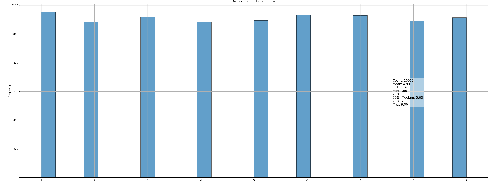
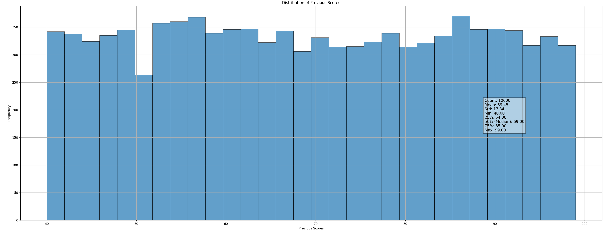
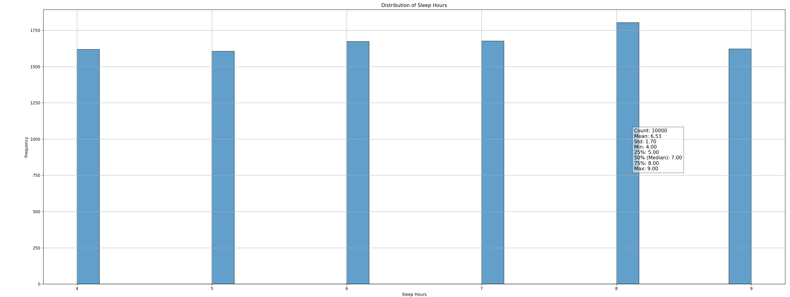
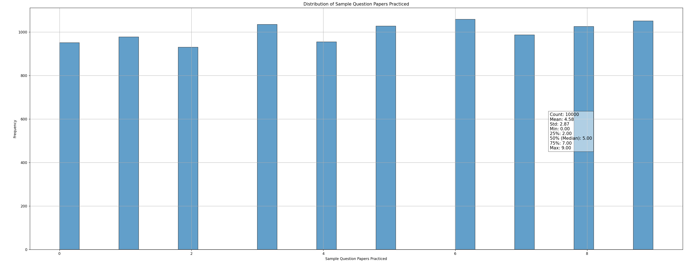
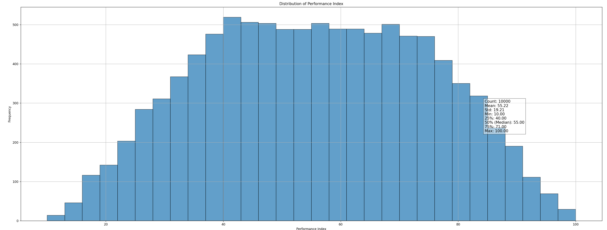
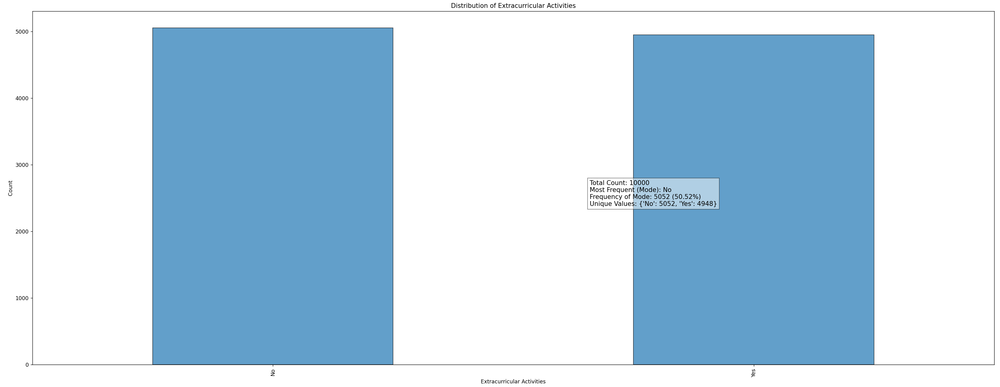

# Лабораторная 3. Линейная регрессия.
## Нечетный вариант.

### Визуализация

**Часы обучения**


**Предыдущие оценки**


**Часы сна**


**Подготовительные тесты**


**Успеваемость**


**Дополнительные занятия**


### Обработка данных
- Отсутствующих значений нет
- Кодирование категориальных признаков:
```python
categorical_columns = data.select_dtypes(include=['object']).columns
data_encoded = pd.get_dummies(data, columns=categorical_columns)
```
- Нормировка:
```python
for column in numerical_columns:
    mean = data_encoded[column].mean()
    std = data_encoded[column].std()
    data_encoded[column] = (data_encoded[column] - mean) / std
```

### Разделение данных
20% test/80% learn, с перемешиванием
```python
test_size = 0.2
train_size = 1 - test_size

n_train = int(train_size * len(data_encoded))

indices = np.random.permutation(len(data_encoded))

train_indices = indices[:n_train]
test_indices = indices[n_train:]

X_train = X.iloc[train_indices]
X_test = X.iloc[test_indices]
y_train = y.iloc[train_indices]
y_test = y.iloc[test_indices]
```


### Линейная регрессия
```python
def linear_regression(X_train, y_train, epochs=1000, learning_rate=0.01):
    X_train = X_train.astype(np.float64)
    y_train = y_train.astype(np.float64)
    n_samples, n_features = X_train.shape

    weights = np.zeros(n_features)
    bias = 0

    history = []

    for epoch in range(epochs):
        y_predicted = np.dot(X_train, weights) + bias

        error = y_predicted - y_train
        mse = (1 / n_samples) * np.sum(error ** 2)
        history.append(mse)

        dw = (1 / n_samples) * np.dot(X_train.T, error)
        db = (1 / n_samples) * np.sum(error)

        weights -= learning_rate * dw
        bias -= learning_rate * db

        if epoch % 100 == 0:
            print(f'Epoch {epoch}, MSE: {mse:.4f}')

    return weights, bias, history
```

### Три модели
- Модель 1 cодержит признаки `'Hours Studied', 'Previous Scores', 'Sample Question Papers Practiced'`
- Модель 2 содержит признаки `'Sleep Hours', 'Extracurricular Activities_Yes'` и синтетический признак `'Previous_Sleep_Interaction'] = 'Previous Scores' * 'Sleep Hours'`
- Модель 3 содержит все признаки 

Предсказывается Performance Index

### R^2 метрика
```python
def r_squared(y_true, y_pred):
    ss_res = np.sum((y_true - y_pred) ** 2)
    ss_tot = np.sum((y_true - np.mean(y_true)) ** 2)
    r2 = 1 - (ss_res / ss_tot)
    return r2
```

### Сравнение результатов
- Модель 1 (Академические признаки): R² Train = 0.9867, R² Test = 0.9869
- Модель 2 (Неакадемические признаки + синтетика): R² Train = 0.0028, R² Test = 0.0024
- Модель 3 (Все признаки): R² Train = 0.9887, R² Test = 0.9891

Как видно, модель 3 получает лучший результат на тестовой и обучающей выборках, тк использует все признаки. Модель 2 имеет худшие показатели, так как использует признаки, которые плохо связаны с Performance Index
