# Лабораторная 4. kNN.
## Нечетный вариант. Раевский Григорий Романович, P3321


### Исходные данные
```
   Pregnancies  Glucose  BloodPressure  ...  Pedigree  Age  Outcome
0            6      148             72  ...     0.627   50        1
1            1       85             66  ...     0.351   31        0
2            8      183             64  ...     0.672   32        1
3            1       89             66  ...     0.167   21        0
4            0      137             40  ...     2.288   33        1
```
### Обработка данных
- Отсутствующих значений нет
- Категориальных признаков нет
- Масштабирование признаков:
```python
for column in data:
    mean = data[column].mean()
    std = data[column].std()
    data[column] = (data[column] - mean) / std
```

### Визуализация


**Беременности**
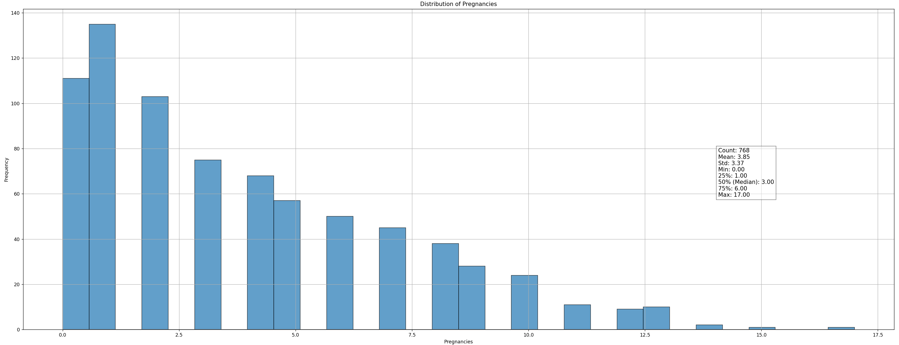

**Глюкоза**
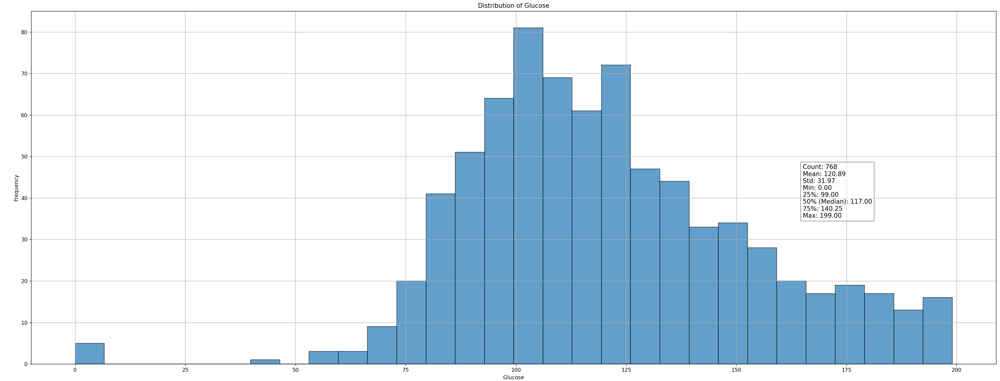

**Давление крови**
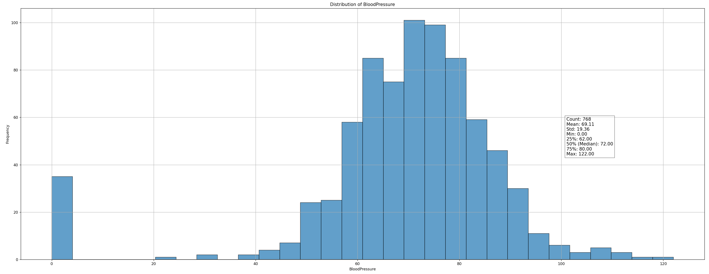

**Толщина кожи**
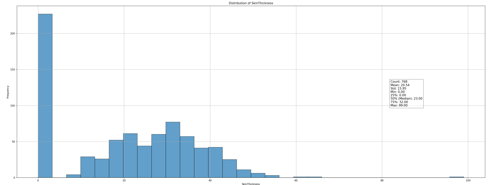

**Инсулин**
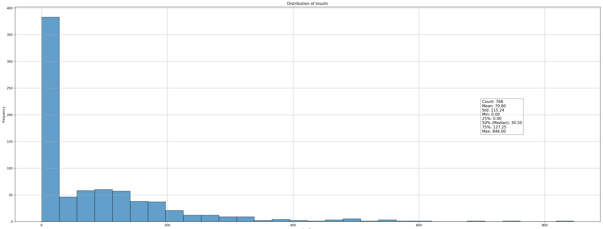

**Индекс массы тела**
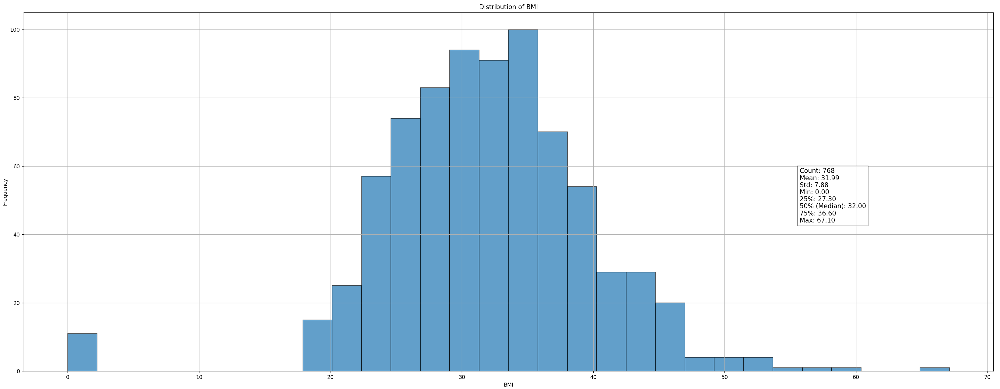

**Родословная**
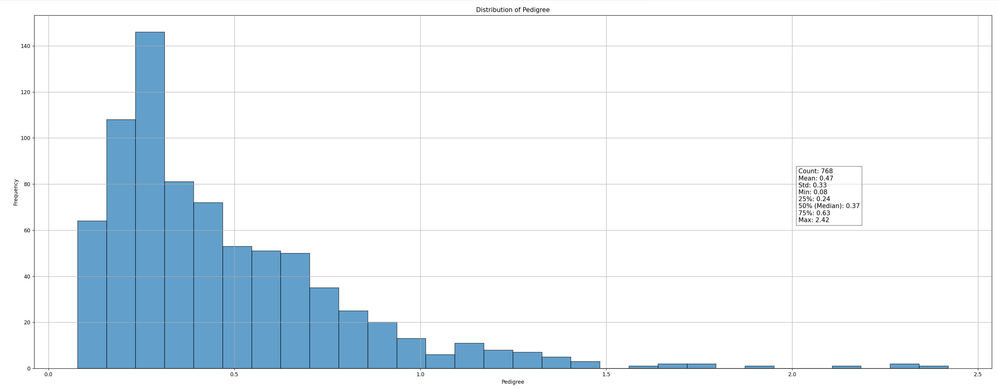

**Возраст**
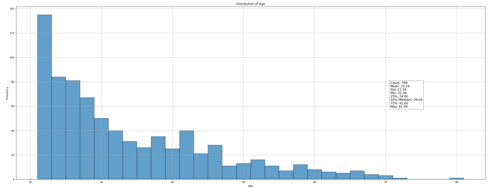

**Результат**
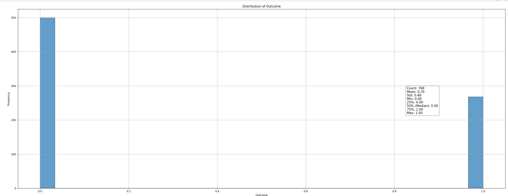

**Связь глюкозы, возраста и индекса массы**
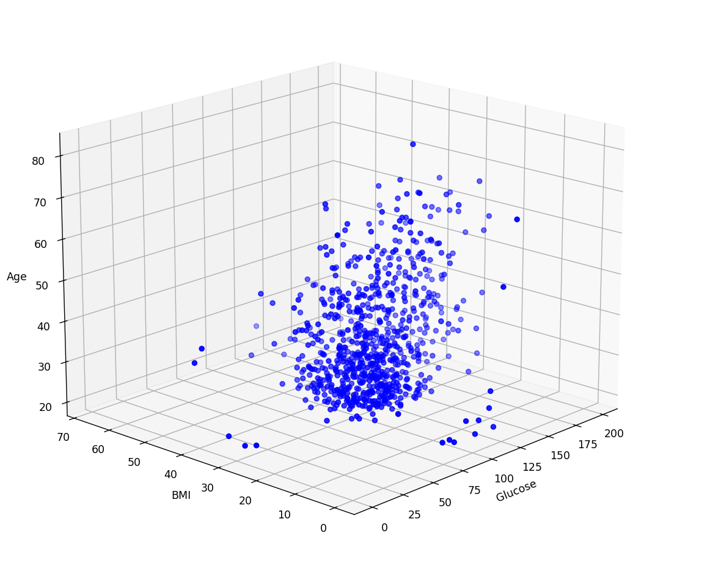

### kNN
- Евклидово расстояние
```python
def distance(x1, x2):
    return np.sqrt(np.sum((x1 - x2) ** 2))
```
- Метод
```python
def kNN(X_train, y_train, X_test, k=3):
    y_pred = []
    for x_test in X_test:
        distances = []
        for i in range(len(X_train)):
            dist = distance(X_train[i], x_test)
            distances.append((dist, y_train[i]))
        distances.sort(key=lambda x: x[0])

        neighbors = distances[:k]
        neighbor_labels = [neighbor[1] for neighbor in neighbors]
        most_common = Counter(neighbor_labels).most_common(1)[0][0]
        y_pred.append(most_common)

    return np.array(y_pred)
```

### Модели
- Модель 1, случайные признаки
```python
np.random.seed(0)
random_features = np.random.choice(X.columns, 3, replace=False)
X_train_model_1 = X_train[:, [X.columns.get_loc(col) for col in random_features]]
X_test_model_1 = X_test[:, [X.columns.get_loc(col) for col in random_features]]
```
- Модель 2, `'Glucose', 'BMI', 'Age'`
```python
fixed_features = ['Glucose', 'BMI', 'Age']
X_train_model_2 = X_train[:, [X.columns.get_loc(col) for col in fixed_features]]
X_test_model_2 = X_test[:, [X.columns.get_loc(col) for col in fixed_features]]
```

### Метрики
- Точность
```python
def accuracy_score(cm):
    TP, TN, FP, FN = cm[1, 1], cm[0, 0], cm[0, 1], cm[1, 0]
    return (TP + TN) / (TP + TN + FP + FN)
```
- F1 мера
```python
def f1_score(cm):
    TP, TN, FP, FN = cm[1, 1], cm[0, 0], cm[0, 1], cm[1, 0]
    precision = TP / (TP + FP) if (TP + FP) != 0 else 0
    recall = TP / (TP + FN) if (TP + FN) != 0 else 0
    return 2 * (precision * recall) / (precision + recall) if (precision + recall) != 0 else 0
```

### Результаты
- k=3
  - Модель 1
  - Модель 2
- k=5
  - Модель 1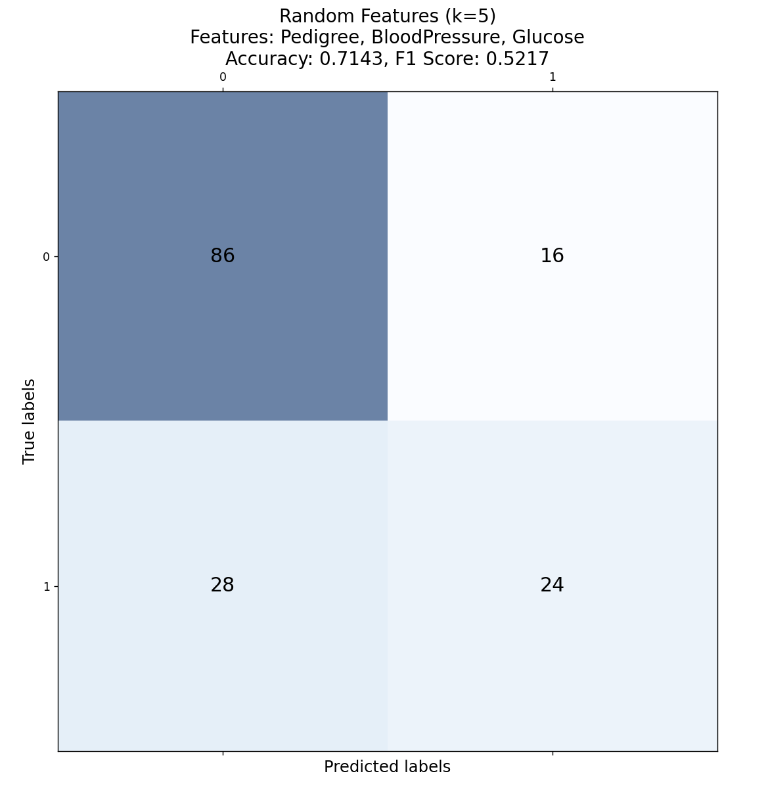
  - Модель 2
- k=10
  - Модель 1
  - Модель 2
- k=15
  - Модель 1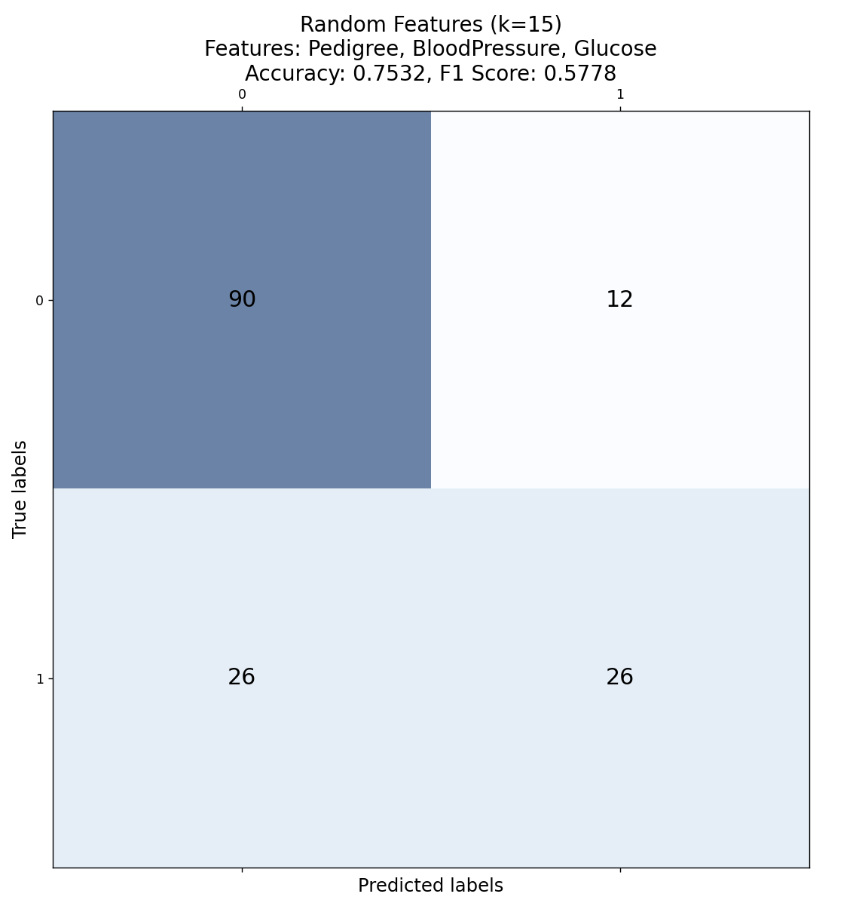
  - Модель 2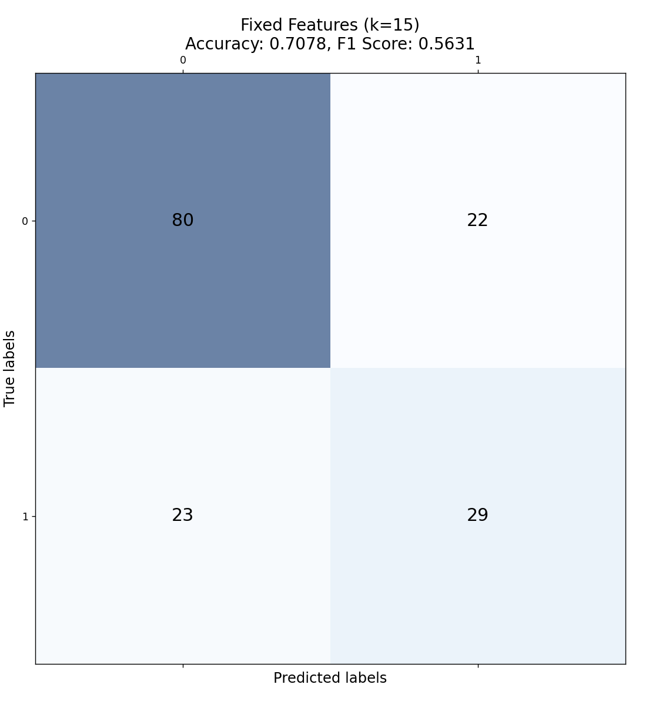
- k=30
  - Модель 1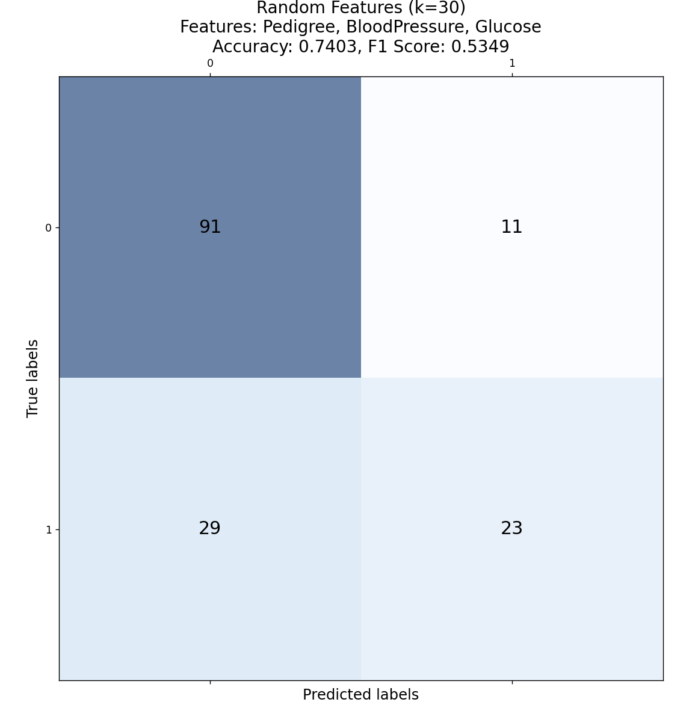
  - Модель 2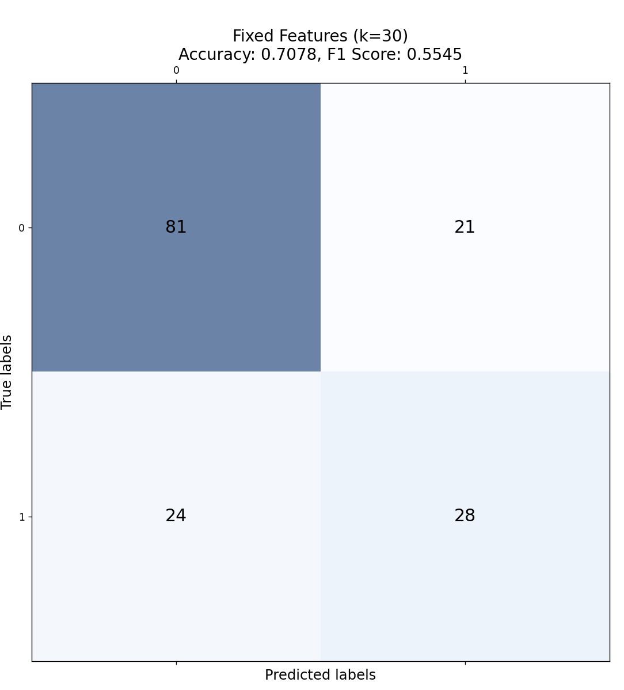

Самый лучший результат (по F1 мере) - первая модель при k=15 (F1 - 0.5778, Accuracy - 0.7532)