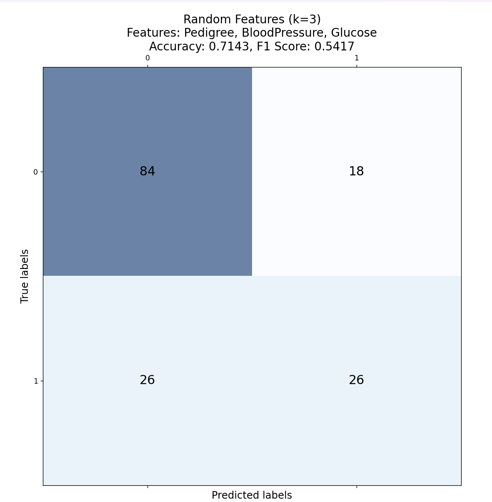
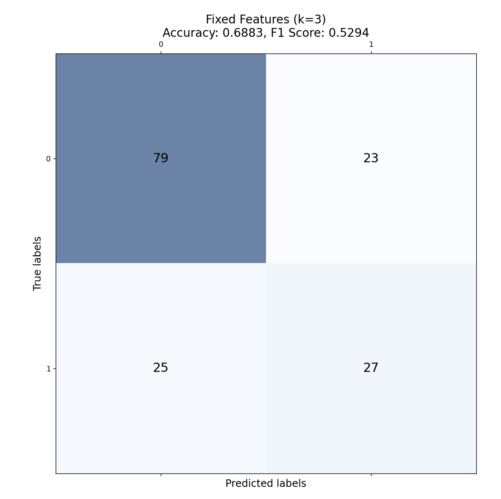
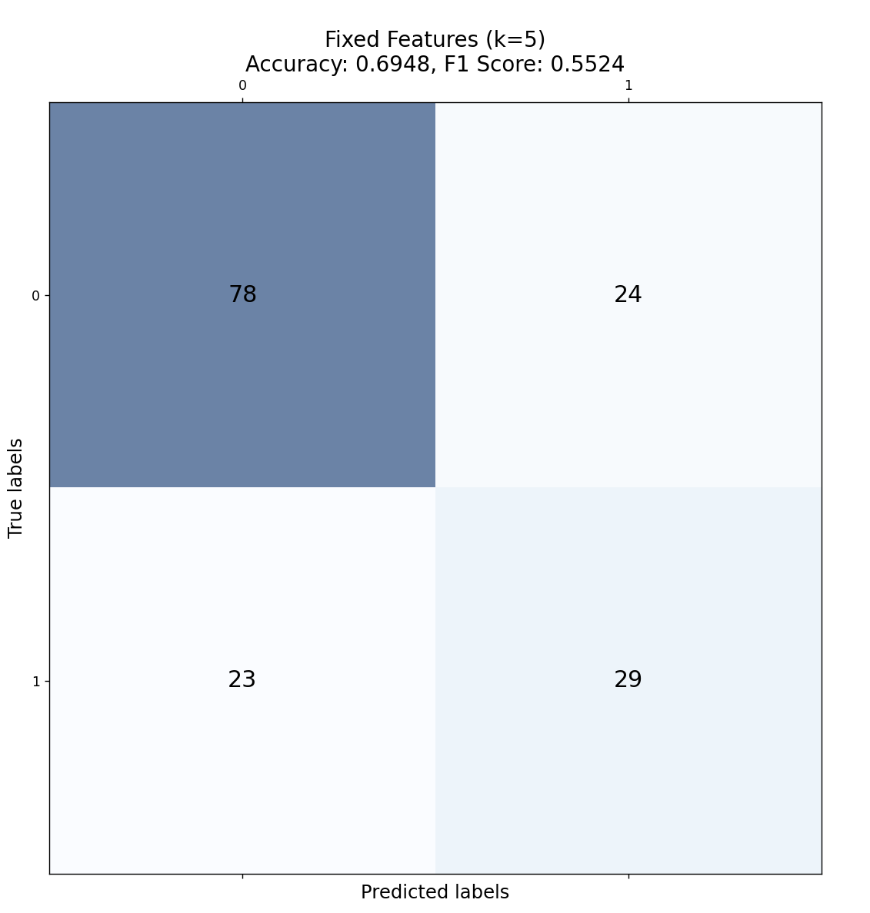
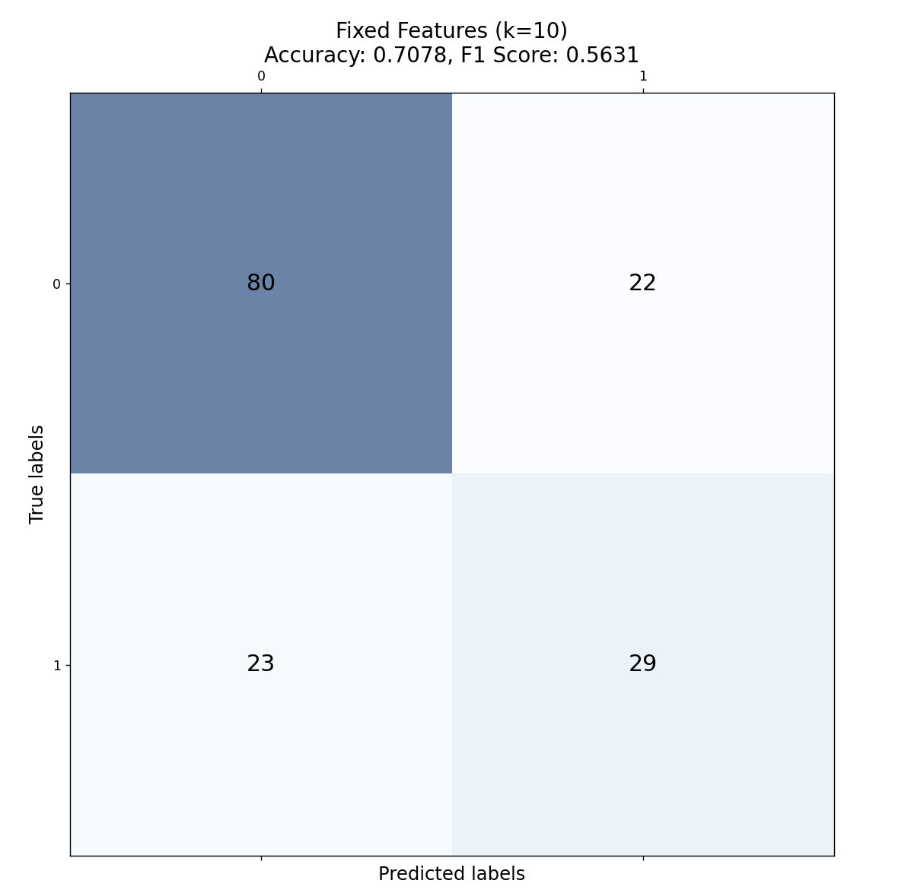

# Модуль 2. Отчет по лабораторным работам.
## Раевский Григорий Романович, P3321, ИСУ 386871

## Лабораторная работа 1. Метод линейной регрессии

### Введение

Задача работы - на основе различных признаков студентов предсказывать их Performance Index. Для решения задачи используется линейная регресия и метрика R^2.
Цели:
- Провести анализ данных и визуализировать распределение академических и неакадемических признаков.
- Построить три модели линейной регрессии на основе различных наборов признаков (академические, неакадемические с синтетическим признаком, все признаки).
- Оценить качество каждой модели по метрикам R² для тренировочной и тестовой выборок.
- Сравнить результаты моделей и сделать выводы о значимости различных типов признаков для предсказания индекса успеваемости студентов.

### Описание метода

Линейная регрессия — это один из наиболее простых методов машинного обучения, который используется для моделирования зависимости одной переменной (целевой) от одного или нескольких других параметров. Основная цель линейной регрессии — найти такую прямую, которая наилучшим образом аппроксимирует зависимость между переменными.

$$ y = \theta_{0}+\theta_{1}x_{1}+\theta_{2}x_{2}+...+\theta_{n}x_{n} $$


Для нахождения оптимальных значений коэффициентов используется метод наименьших квадратов, который минимизирует сумму квадратов отклонений предсказанных значений от фактических:
$$ min_{\theta}{\sum_{i=1}^{m}{(y_{i}-\hat{y_{i}})^{2}}} $$ 

Метод линейной регрессии эффективен для данных с линейной зависимостью и хорошо интерпретируем. Однако его ограничением является невозможность моделирования нелинейных зависимостей.

### Псевдокод метода
```css
Вход:
    X_train - матрица признаков тренировочных данных
    y_train - целевая переменная для тренировочных данных
    X_test - матрица признаков тестовых данных

Расчет коэфициентов: theta = (X_train^T * X_train)^(-1) * X_train^T * y_train

Для каждого x_test в X_test:
    Расчет предсказанного значения y_pred на основе коэфициентов theta: y_pred = x_test * theta

Результат - предсказание y_pred
```


### Результаты выполнения

- Модель 1 - Академические признаки: $R^{2}_{Train} = 0.9868, R^{2}_{Test} = 0.9863$
- Модель 2 - Неакадемические признаки + синтетический признак: $R^{2}_{Train} = 0.0027, R^{2}_{Test} = 0.0026$
- Модель 3 - Все признаки: $R^{2}_{Train} = 0.9888, R^{2}_{Test} = 0.9885$

Модель 3 показывает наилучший результат на тестовых данных.

### Примеры использования метода

- Прогнозирование продаж на основе затрат на рекламу: Линейная регрессия позволяет выявить, как реклама влияет на рост продаж. Она помогает компаниям оценить, сколько доходов принесут дополнительные вложения в рекламу.

- Анализ влияния учебных часов на оценки: Линейная регрессия помогает оценить, насколько увеличение времени учебы может улучшить успеваемость студентов, предоставляя администрациям образовательных учреждений четкие рекомендации.

- Оценка стоимости жилья: В риэлторском бизнесе регрессия используется для определения зависимости цены жилья от его характеристик, таких как площадь и количество комнат.

- Прогнозирование доходов по объему производства: Производственные компании используют регрессию для предсказания будущих доходов на основе объема произведенной продукции.

- Оценка риска заболеваний в зависимости от физической активности: В медицине линейная регрессия помогает оценить, как увеличение физической активности снижает риск развития сердечно-сосудистых заболеваний.

Почему выбран метод:
- Простота интерпретации: Легко понять, как независимые переменные влияют на результат.
- Прямолинейная связь: Позволяет оценить линейные зависимости, что удобно в бизнесе, образовании и медицине.
- Низкие вычислительные затраты: Легко использовать для больших объемов данных.
- Широкая применимость: Подходит для задач, где между переменными можно предположить линейную зависимость.
## Лабораторная работа 2. Метод k-ближайших соседей (k-NN)

### Введение

Цель работы — использование метода ближайших соседей (kNN) для предсказания вероятности наличия диабета у пациентов на основе набора медицинских данных, таких как уровень глюкозы, ИМТ (индекс массы тела), возраст и другие. Целевая переменная — столбец "Outcome", где значение 1 означает наличие диабета, а 0 — его отсутствие.

Цели:
- Произвести предобработку данных (масштабирование признаков и очистка от пропущенных значений).
- Реализовать метод ближайших соседей (kNN) для предсказания диагноза (наличие/отсутствие диабета) на основе тренировочных данных.
- Построить две модели:
- Первая модель на случайно выбранных признаках.
- Вторая модель на фиксированных признаках (глюкоза, ИМТ, возраст).
- Оценить качество моделей с использованием метрик точности (accuracy) и F1-меры для разных значений параметра k.
- Визуализировать результаты с помощью матрицы ошибок и сравнить точность моделей.
### Описание метода

Метод k-ближайших соседей (kNN) — это простой, но эффективный алгоритм машинного обучения для задач классификации и регрессии. Он основан на предположении, что объекты с похожими признаками находятся близко друг к другу в пространстве данных.

Принцип работы:
- Определение числа соседей (k): Выбирается число ближайших соседей, которые будут учитываться при классификации нового объекта.
- Рассчет расстояний: Для нового объекта вычисляется расстояние до всех объектов в тренировочном наборе данных (чаще всего используется евклидово расстояние).
- Определение ближайших соседей: Выбираются k объектов с минимальными расстояниями до нового объекта.
- Классификация: Новый объект относится к тому классу, к которому принадлежит большинство из k ближайших соседей (метод голосования).
- Для работы kNN необходимо масштабировать данные, чтобы признаки с большими значениями не доминировали при расчете расстояний.
### Псевдокод метода

```css
Вход:
    X_train - матрица признаков тренировочных данных
    y_train - метки классов тренировочных данных
    X_test - матрица признаков тестовых данных
    k - число ближайших соседей

Для каждого x_test в X_test:
    distances = []
    
    Для каждого x_train в X_train:
        Расчет евклидовой дистанции между x_train и x_test
        Дистанция и соответствующая y_train сохраняется в distances
    
    Сортировка distance по возрастанию

    
    Выбор k ближайших соседей
    Для k соседей получить y_train

    На основе самого часто встречающегося y_train выбрать класс для x_test
Для каждого x_test в X_test теперь существует метка класса, к которому он принадлежит
```


### Результаты выполнения

Было реализовано 2 модели:
- Модель 1 - случайные признаки
- Модель 2 - BMI, Glucose и Age

Тесты проводились при различных k:
- k=3
  - Модель 1
  - Модель 2
- k=5
  - Модель 1
  - Модель 2
- k=10
  - Модель 1
  - Модель 2
- k=15
  - Модель 1
  - Модель 2
- k=30
  - Модель 1
  - Модель 2

Самый лучший результат (по F1 мере) - первая модель при k=15 (F1 - 0.5778, Accuracy - 0.7532)

### Примеры использования метода

- Распознавание рукописного текста:
Программа для распознавания рукописных цифр (например, MNIST). Рукописные цифры можно сравнивать по сходству их изображений. kNN классифицирует каждую цифру, находя изображения, похожие на нее по форме, и определяет наиболее частый класс среди ближайших соседей.

- Диагностика заболеваний: Классификация пациентов по наличию/отсутствию диабета на основе медицинских данных. Пациенты с похожими медицинскими показателями (например, уровень глюкозы, ИМТ) с большой вероятностью имеют одинаковые диагнозы. kNN позволяет находить таких пациентов и на основе их данных предсказывать диагноз нового пациента.

-Рекомендательные системы: Рекомендации фильмов пользователям на основе предпочтений других пользователей. Пользователям предлагаются фильмы, которые понравились их «ближайшим соседям» — людям с похожими вкусами. kNN помогает находить таких пользователей на основе их предпочтений и рекомендовать фильмы, которые они оценили положительно.

- Классификация изображений: Классификация фотографий по категориям (например, «кот», «собака», «автомобиль»). Изображения с похожими визуальными характеристиками (например, текстура, форма) обычно принадлежат одному и тому же классу. kNN находит фотографии, наиболее похожие на классифицируемое изображение, и относит его к тому же классу, что и ближайшие соседи.

- Обнаружение мошеннических транзакций: Банковская система должна определить, является ли транзакция мошеннической. kNN помогает сравнивать текущую транзакцию с историческими данными и классифицировать её, исходя из того, были ли похожие транзакции в прошлом мошенническими.

Почему выбран метод:
- Отсутствие необходимости обучения: kNN не требует предварительного обучения модели, что делает его удобным для задач, где данные могут быстро изменяться.
- Простота в применении: Алгоритм прост в реализации и понятен для использования в разных областях, таких как медицина, обработка изображений и рекомендательные системы.
- Гибкость: kNN можно применять к различным типам данных — от числовых значений до изображений и текстов, где важно сходство между объектами.

## Лабораторная работа 3. Деревья решений

### Введение

Тема лабораторной работы — использование алгоритма деревьев решений для классификации данных о студентах и их успеваемости. Деревья решений — это метод, который позволяет классифицировать объекты, принимая решения на каждом этапе в зависимости от значений признаков.

Датасет включает информацию о студентах, таких как различные параметры, влияющие на их оценки по курсу. Задача заключается в создании модели классификации с использованием алгоритма дерева решений, чтобы предсказать итоговую оценку студентов на основе этих параметров.

- Проанализировать исходные данные.
- Добавить метрику успешности студентов
- Построить модель дерева решений для предсказания оценок студентов.
- Оценить качество модели с использованием метрик, таких как точность, полнота и тд.
### Описание метода

Деревья решений — это популярный метод машинного обучения, который используется для задач классификации и регрессии. В основе метода лежит построение древовидной структуры, где каждый внутренний узел представляет собой проверку на некотором признаке, каждая ветвь — результат проверки, а каждый лист — предсказание класса (в задачах классификации) или значения (в задачах регрессии).

Метод деревьев решений используется для принятия решений на основе данных и их признаков. Он полезен для классификации объектов или предсказания значений, делая выборки иерархически разделенными по условиям.

Принцип работы:
- Корень и узлы: Вершина дерева (корень) содержит весь набор данных. На каждом шаге дерево разделяет данные по определенному признаку так, чтобы максимально увеличить чистоту разделения.
- Ветвление: В каждом узле проверяется условие на один из признаков, и данные разделяются на две или более группы. Разделение происходит таким образом, чтобы уменьшить "неоднородность" (например, уменьшить энтропию или индекс Джини).
- Листовые узлы: Когда дальнейшее разделение нецелесообразно или невозможно (например, когда все данные в узле принадлежат одному классу), процесс разделения останавливается, и узел становится листом с предсказанием.
- Оценка качества разбиений: Для оценки качества разбиений используются метрики, такие как:
  - Энтропия — мера неопределенности в данных.
  - Индекс Джини — мера "чистоты" группы объектов.
- Обучение и предсказание: В процессе обучения дерево решений строится на основе тренировочных данных. Для предсказания новых данных проверяются условия в каждом узле, и объект перемещается по дереву до достижения листа, где выдается предсказание.

Особенности:
- Деревья решений легко интерпретировать, так как их структура позволяет наглядно отслеживать процесс принятия решений.
- Этот метод особенно полезен, когда данные содержат сложные иерархические зависимости между признаками.
### Псевдокод метода

```css
Вход: 
    X - матрица признаков студентов
    y - метки классов (Успешность)

build_tree(X, y, глубина):
    Если все объекты в узле принадлежат одному классу или достигнута максимальная глубина:
        Вернуьб листовой узел с предсказанием (класс большинства)

    Для каждого признака:
        Расчет качества разбиения для каждого возможного порога
        
    Выбрать лучший признак и порог для разбиения

    Разбить данные по выбранному признаку и порогу:
        X_left, y_left = данные, которые удовлетворяют условию
        X_right, y_right = данные, которые не удовлетворяют условию

    Создание узла с условием разбиения

    Рекурсивное создание левого и правого поддеревьев:
        left_subtree = build_tree(X_left, y_left, depth + 1)
        right_subtree = build_tree(X_right, y_right, depth + 1)

    Вернуть узел с левым и правым поддеревом

predict(x_new, tree):
    Начало - вершина дерева
    Пока не достигнут лист:
        Если x_new удовлетворяет условию узла:
            Перейти в левое\правое поддерево
        Иначе:
            Перейти в противоположное поддерево
    Вернуть класс из листа

Output: дерево решений и предсказания
```

### Результаты выполнения

Результаты работы модели:
- Accuracy: 0.58
- Precision: 0.63
- Recall: 0.52

Оценки:
- AUC-ROC: 0.49
- AUC-PR: 0.28

### Примеры использования метода

- Классификация студентов по итоговой оценке: В университете нужно предсказать итоговую оценку студента по его активности, оценкам за промежуточные тесты и другим характеристикам. Деревья решений легко интерпретируются и позволяют наглядно видеть, какие параметры влияют на итоговую оценку. Они могут использовать как числовые, так и категориальные признаки.

- Медицинская диагностика: Врач хочет предсказать диагноз пациента на основе его симптомов, результатов анализов и других факторов. Деревья решений полезны для медицинской диагностики, так как они позволяют четко описывать, какие симптомы или анализы привели к определенному диагнозу, делая модель более понятной и прозрачной для врачей.

- Анализ кредитоспособности клиента: Банк хочет оценить, стоит ли выдавать кредит клиенту на основе его финансовой истории, доходов, возраста и других факторов. Деревья решений могут легко разделять клиентов на группы, основываясь на конкретных финансовых показателях, что позволяет точно и прозрачно оценить риски невозврата кредита.

- Рекомендательные системы: Онлайн-магазин хочет рекомендовать пользователям товары на основе их поведения и предыдущих покупок. Деревья решений могут использоваться для сегментации пользователей, чтобы предложить каждому подходящий продукт, основываясь на их интересах и действиях.

- Обнаружение мошенничества: Платежная система пытается обнаружить мошеннические транзакции на основе таких факторов, как время, сумма, местоположение и другие параметры транзакции. Деревья решений могут выявить, какие комбинации факторов чаще всего связаны с мошенническими действиями, предоставляя понятные правила для выявления подозрительных операций.

Почему выбран метод:
- Простота интерпретации: Деревья решений легко интерпретируются, что важно в ситуациях, где нужно объяснить результаты (например, в медицине или финансах).
- Работа с разными типами данных: Деревья могут работать с как числовыми, так и категориальными данными.
- Наглядность: Модель дерева решений показывает, как каждый шаг и каждое условие влияют на конечный результат, что полезно для анализа и объяснений.
- Работа с небольшими наборами данных: Деревья решений могут быть эффективны даже на небольших выборках, где сложные модели могут переобучаться или давать менее интерпретируемые результаты.
## Лабораторная работа 4. Логистическая регрессия

### Введение

Описание задачи:

Задача данной лабораторной работы — разработка и реализация модели логистической регрессии для решения задачи бинарной классификации на основе медицинских данных о пациентах. В частности, цель заключается в предсказании вероятности того, что пациент болен диабетом, основываясь на таких характеристиках, как уровень глюкозы, артериальное давление, ИМТ и другие факторы.

Цели:
- Визаулизация данных (количество, среднее значение, стандартное отклонение, минимум, максимум и различные квантили)ю
- Предобработка данных: Провести предварительную обработку данных и разделить выборку на тестовую и обучающую.
- Разработка модели логистической регрессии: Реализовать алгоритм логистической регрессии для предсказания наличия диабета на основе независимых переменных.
- Исследование гиперпараметров модели
- Оценка модели: Оценить качество модели с использованием метрик, таких как точность, F1-мера, полнота, чтобы определить её эффективность в задаче классификации.
### Описание метода

Логистическая регрессия — это метод машинного обучения, который используется для решения задач бинарной классификации. В отличие от линейной регрессии, которая предсказывает непрерывные значения, логистическая регрессия предсказывает вероятность того, что объект принадлежит к одному из двух классов (например, болен человек диабетом или нет).

Принцип работы:
- Для каждого объекта рассчитывается линейная комбинация признаков: $z=\theta_{0}+\theta_{1}x_{1}+...+\theta_{n}x_{n}$.
- Для преобразования линейной комбинации в вероятность используется сигмоидная функция: $P(y=1) =\frac{1}{1+e^{-z}}$.
- Полученная вероятность сравнивается с порогом (обычно 0.5). Если вероятность выше порога, то объект относят к классу 1, иначе — к классу 0. 
- Логарифмическая функция потерь: $-\frac{1}{m}\sum_{i=1}^{m}{(y_{i}log(\hat{y}_{i})+(1-y_{i})log(1-\hat{y}_{i}) )}$
- Для оптимизации весов могут используются градиентный спуск, метод ньютона и другое
​
Особенности:
- Логистическая регрессия хорошо работает, когда классы четко разделимы, и модель легко интерпретируется.
- Она возвращает не только класс, но и вероятность принадлежности к этому классу, что полезно в ситуациях с неуверенными предсказаниями.
### Псевдокод метода

```css
Вход:
    X - матрица признаков
    y - метки классов (0 или 1)
    alpha - скорость обучения
    epochs - количество эпох

Инициализация:
    theta = [случайные значения]

Для каждой эпохи по очереди из эпох:
    Для каждого i из m: # m примеров
        z_i = theta_0 + theta_1 * X[i, 1] + ... + theta_n * X[i, n]  # Линейная комбинация признаков
        y_hat_i = 1 / (1 + exp(-z_i))  # Сигмоидная функция

        Для каждого j из n: # n признаков
            gradient_j = (y_hat_i - y[i]) * X[i, j]  # Градиент для веса j
            theta_j = theta_j - alpha * gradient_j  # Обновление веса j

predict(X):
    Для каждого x в X:
        z_new = theta_0 + theta_1 * x[1] + ... + theta_n * x[n]  # Линейная комбинация признаков
        y_hat_new = 1 / (1 + exp(-z_new))  # Сигмоидная функция
        If y_hat_new >= 0.5:
            return 1  # Предсказать класс 1
        Else:
            return 0  # Предсказать класс 0

```

### Результаты выполнения

| №  | method   | learning_rate | epochs |        loss |  accuracy | precision |    recall | f1_score |
|----|----------|---------------|--------|-------------|-----------|-----------|-----------|----------|
|  0 | gradient |         0.001 |    500 |  106.374161 |  0.746753 |   0.70000 |  0.593220 |  0.64220 |
|  1 | gradient |         0.001 |   1000 |  106.920517 |  0.733766 |   0.68750 |  0.559322 |  0.61682 |
|  2 | gradient |         0.001 |   2000 |  108.969394 |  0.727273 |   0.68085 |  0.542373 |  0.60377 |
|  3 | gradient |         0.001 |   5000 |  115.206123 |  0.740260 |   0.72093 |  0.525424 |  0.60784 |
|  4 | gradient |         0.010 |    500 |  115.219278 |  0.740260 |   0.72093 |  0.525424 |  0.60784 |
|  5 | gradient |         0.010 |   1000 |  122.096868 |  0.746753 |   0.73810 |  0.525424 |  0.61386 |
|  6 | gradient |         0.010 |   2000 |  129.224672 |  0.759740 |   0.76191 |  0.542373 |  0.63366 |
|  7 | gradient |         0.010 |   5000 |  134.701392 |  0.740260 |   0.74359 |  0.491525 |  0.59184 |
|  8 | gradient |         0.100 |    500 |  134.712255 |  0.740260 |   0.74359 |  0.491525 |  0.59184 |
|  9 | gradient |         0.100 |   1000 |  135.404693 |  0.740260 |   0.74359 |  0.491525 |  0.59184 |
| 10 | gradient |         0.100 |   2000 |  135.428128 |  0.740260 |   0.74359 |  0.491525 |  0.59184 |
| 11 | gradient |         0.100 |   5000 |  135.428165 |  0.740260 |   0.74359 |  0.491525 |  0.59184 |
| 12 | gradient |         0.500 |    500 |  135.428163 |  0.740260 |   0.74359 |  0.491525 |  0.59184 |
| 13 | gradient |         0.500 |   1000 |  135.428165 |  0.740260 |   0.74359 |  0.491525 |  0.59184 |
| 14 | gradient |         0.500 |   2000 |  135.428165 |  0.740260 |   0.74359 |  0.491525 |  0.59184 |
| 15 | gradient |         0.500 |   5000 |  135.428165 |  0.740260 |   0.74359 |  0.491525 |  0.59184 |
| 16 | gradient |         1.000 |    500 |  135.428165 |  0.740260 |   0.74359 |  0.491525 |  0.59184 |
| 17 | gradient |         1.000 |   1000 |  135.428165 |  0.740260 |   0.74359 |  0.491525 |  0.59184 |
| 18 | gradient |         1.000 |   2000 |  135.428165 |  0.740260 |   0.74359 |  0.491525 |  0.59184 |
| 19 | gradient |         1.000 |   5000 |  135.428165 |  0.740260 |   0.74359 |  0.491525 |  0.59184 |
|  0 | newton   |         0.001 |    500 |  135.428165 |  0.740260 |   0.74359 |  0.491525 |  0.59184 |
|  1 | newton   |         0.001 |   1000 |  135.428165 |  0.740260 |   0.74359 |  0.491525 |  0.59184 |
|  2 | newton   |         0.001 |   2000 |  135.428165 |  0.740260 |   0.74359 |  0.491525 |  0.59184 |
|  3 | newton   |         0.001 |   5000 |  135.428165 |  0.740260 |   0.74359 |  0.491525 |  0.59184 |
|  4 | newton   |         0.010 |    500 |  135.428165 |  0.740260 |   0.74359 |  0.491525 |  0.59184 |
|  5 | newton   |         0.010 |   1000 |  135.428165 |  0.740260 |   0.74359 |  0.491525 |  0.59184 |
|  6 | newton   |         0.010 |   2000 |  135.428165 |  0.740260 |   0.74359 |  0.491525 |  0.59184 |
|  7 | newton   |         0.010 |   5000 |  135.428165 |  0.740260 |   0.74359 |  0.491525 |  0.59184 |
|  8 | newton   |         0.100 |    500 |  135.428165 |  0.740260 |   0.74359 |  0.491525 |  0.59184 |
|  9 | newton   |         0.100 |   1000 |  135.428165 |  0.740260 |   0.74359 |  0.491525 |  0.59184 |
| 10 | newton   |         0.100 |   2000 |  135.428165 |  0.740260 |   0.74359 |  0.491525 |  0.59184 |
| 11 | newton   |         0.100 |   5000 |  135.428165 |  0.740260 |   0.74359 |  0.491525 |  0.59184 |
| 12 | newton   |         0.500 |    500 |  135.428165 |  0.740260 |   0.74359 |  0.491525 |  0.59184 |
| 13 | newton   |         0.500 |   1000 |  135.428165 |  0.740260 |   0.74359 |  0.491525 |  0.59184 |
| 14 | newton   |         0.500 |   2000 |  135.428165 |  0.740260 |   0.74359 |  0.491525 |  0.59184 |
| 15 | newton   |         0.500 |   5000 |  135.428165 |  0.740260 |   0.74359 |  0.491525 |  0.59184 |
| 16 | newton   |         1.000 |    500 |  135.428165 |  0.740260 |   0.74359 |  0.491525 |  0.59184 |
| 17 | newton   |         1.000 |   1000 |  135.428165 |  0.740260 |   0.74359 |  0.491525 |  0.59184 |
| 18 | newton   |         1.000 |   2000 |  135.428165 |  0.740260 |   0.74359 |  0.491525 |  0.59184 |
| 19 | newton   |         1.000 |   5000 |  135.428165 |  0.740260 |   0.74359 |  0.491525 |  0.59184 |

Лучший результат по F1: градиентный метод, с lr 0.001 и количеством эпох 500 
### Примеры использования метода

- Предсказание наличия заболевания (например, диабет): Врачи используют данные о пациентах (например, уровень глюкозы, ИМТ и возраст) для предсказания, болен ли пациент диабетом (да или нет). адача бинарной классификации — определить, принадлежит ли пациент к классу "болен" или "здоров". Логистическая регрессия лучше подходит, чем линейная, поскольку она выдает вероятность принадлежности к одному из классов и ограничивает результат значениями от 0 до 1, что делает её более естественным выбором для таких задач.

- Отбор кандидатов на вакансию: Компания анализирует резюме кандидатов на основе их опыта, образования и навыков, чтобы решить, стоит ли приглашать кандидата на собеседование. Логистическая регрессия используется для задачи классификации (принять или отклонить кандидата). Линейная регрессия может предсказать значение, выходящее за диапазон [0, 1], что неинтерпретируемо в контексте решения "да" или "нет". Логистическая регрессия же предсказывает вероятность, которую легко интерпретировать.

- Оценка кредитоспособности клиента: Банк предсказывает, одобрить ли клиенту кредит на основе его финансовой истории и текущего состояния. Задача классификации — одобрить кредит или отклонить. Логистическая регрессия выдаёт вероятность того, что клиент сможет вернуть кредит, тогда как линейная регрессия может дать значения за пределами допустимого интервала вероятностей.

- Предсказание ухода клиентов: Компания по оказанию услуг хочет предсказать, какой клиент вероятно прекратит пользоваться их услугами, основываясь на истории покупок и активности. Это задача бинарной классификации: останется ли клиент или уйдёт. Логистическая регрессия лучше интерпретирует вероятность и выдает чёткие классы на основе порога (например, вероятность ухода более 50% означает, что клиент уйдет).

Почему логистическая регрессия, а не линейная регрессия:
- Логистическая регрессия специально разработана для классификации (особенно бинарной), где выходные данные должны быть либо 0, либо 1. Она предсказывает вероятность принадлежности к классу и применяет сигмоидную функцию, которая ограничивает результат значениями от 0 до 1.

- Линейная регрессия предсказывает непрерывные значения и не ограничивает результат, что делает её плохим выбором для задач классификации. Например, она может предсказать значения больше 1 или меньше 0, что не имеет смысла в задачах классификации.

В задачах бинарной классификации логистическая регрессия лучше, так как она возвращает вероятности принадлежности объекта к классу и корректно работает с задачами, где требуется чёткое разделение на два исхода.
## Сравнение методов

### Сравнительный анализ методов

1. Линейная регрессия:

- Задача: Прогнозирование успеваемости студентов на основе их характеристик (оценки, участие в активностях и т.д.).
- Производительность: Линейная регрессия показала хорошие результаты в задачах с линейной зависимостью между признаками и целевой переменной. В задачах классификации, таких как предсказание класса, её производительность уступает другим методам, поскольку она предназначена для предсказания непрерывных значений.
- Преимущества:
   - Простота в реализации и интерпретации.
   - Эффективна при наличии линейной связи между признаками и результатом.
- Ограничения:
   - Плохо справляется с нелинейными зависимостями.
   - Непригодна для задач классификации без модификаций (например, использование логистической регрессии).
   - Может давать предсказания за пределами допустимых значений (например, вне диапазона 0-1 для вероятностей).

2. Метод k-ближайших соседей (kNN):
- Задача: Предсказание наличия диабета на основе медицинских данных.
- Производительность: kNN эффективен в задачах, где объекты одного класса расположены близко друг к другу в пространстве признаков. Однако его производительность сильно зависит от параметра k и объёма данных.
- Преимущества:
  - Легко интерпретируется — метод опирается на близость объектов друг к другу.
  - Не требует обучения модели, так как все вычисления происходят на этапе предсказания.
- Ограничения:
  - Чувствителен к выбору параметра k.
  - Требует масштабирования данных для правильного расчёта расстояний.
  - Неэффективен на больших наборах данных, так как требует пересчёта расстояний для каждого нового объекта.
  - Плохо справляется с задачами с высокой размерностью данных.
3. Деревья решений:
- Задача: Классификация студентов по их оценкам на основе различных признаков (учебные достижения, активности и т.д.).
- Производительность: Деревья решений показали высокую точность и хорошую интерпретацию, особенно в задачах, где признаки чётко разделяют классы. Однако они склонны к переобучению.
- Преимущества:
  - Легко интерпретируются — можно видеть, какие решения и на основе каких признаков принимаются.
  - Могут справляться с нелинейными зависимостями и работать как с числовыми, так и категориальными данными.
  - Не требует масштабирования данных.
- Ограничения:
  - Склонны к переобучению, особенно если не ограничена глубина дерева.
  - Могут быть неустойчивы к небольшим изменениям в данных, что приводит к резким изменениям структуры дерева.
  - В случае большого числа признаков и классов могут становиться менее интерпретируемыми.
4. Логистическая регрессия:
- Задача: Предсказание наличия диабета по медицинским данным.
- Производительность: Логистическая регрессия хорошо справляется с задачами бинарной классификации, такими как диагностика заболеваний или прогнозирование категориальных исходов. Её производительность зависит от линейности границ между классами.
- Преимущества:
  - Подходит для бинарной классификации.
  - Возвращает вероятности принадлежности к классам, что делает её полезной в задачах, где важно учитывать неопределённость.
  - Хорошо интерпретируется и предоставляет веса признаков, влияющих на исход.
- Ограничения:
  - Плохо справляется с нелинейными зависимостями.
  - Требует масштабирования данных для эффективной работы.
  - Не подходит для сложных задач с большим количеством признаков и классов без дополнительных методов (например, полиномиальная логистическая регрессия или регрессия с нелинейными ядрами).


Сравнительный вывод:
- Линейная регрессия хорошо работает для задач, где есть линейная зависимость между признаками и результатом, но не подходит для классификации, где требуются четкие границы между классами.
- Метод k-ближайших соседей (kNN) хорош для задач, где классы образуют кластеры, однако на больших данных он становится неэффективным и чувствителен к параметру k.
- Деревья решений предоставляют хорошие результаты в задачах с нелинейными зависимостями, но склонны к переобучению и нестабильности.
- Логистическая регрессия является эффективным и интерпретируемым методом для задач бинарной классификации, особенно когда границы между классами линейны.
### Примеры лучшего использования каждого метода

1. Линейная регрессия:
- Ситуации: 
  - Прогнозирование числовых значений: Прогнозирование продаж, цены недвижимости, или любых других количественных данных.
  - Анализ зависимости между переменными: Линейная регрессия хороша для понимания того, как изменения одного или нескольких признаков влияют на целевую переменную.
- Почему эффективна:
  - Линейная регрессия эффективна, когда зависимость между признаками и целевой переменной линейна. Она быстро обучается и даёт интерпретируемые результаты, показывая влияние каждого признака.
  - Работает лучше всего на задачах с малым количеством признаков и когда зависимость между данными можно аппроксимировать прямой линией.
2. Метод k-ближайших соседей (kNN):
- Ситуации:
  - Классификация объектов, когда данные имеют кластеры: Прогнозирование наличия болезни на основе медицинских данных или определение вида растений по их морфологическим характеристикам.
  - Рекомендательные системы: kNN эффективен для рекомендательных систем, где на основании поведения или предпочтений пользователей можно делать рекомендации (например, фильмы, продукты).
- Почему эффективен:
  - kNN эффективен, когда классы имеют чётко выраженные кластеры. Он использует принцип близости объектов для классификации.
  - Подходит для небольших и средних наборов данных, когда важна простота реализации. Не требует обучения, что полезно для задач, где часто меняются данные.
3. Деревья решений:
- Ситуации:
  - Классификация объектов с нелинейной зависимостью: Прогнозирование успешности студентов на основе множества параметров (оценки, участие в активностях, предыдущий опыт) или диагностика заболеваний на основе симптомов и медицинских данных.
  - Обработка категориальных данных: Классификация клиентов для маркетинговых целей или принятие решений на основе правил.
- Почему эффективны:
  - Деревья решений могут справляться с нелинейными зависимостями между признаками и целевой переменной, что делает их эффективными для задач, где зависимости сложны.
  - Они работают как с числовыми, так и с категориальными признаками и хорошо визуализируются, что упрощает интерпретацию результатов.
4. Логистическая регрессия:
- Ситуации:
  - Бинарная классификация: Прогнозирование того, заболеет ли человек диабетом (да/нет), одобрить ли заявку на кредит (да/нет), останется ли клиент с компанией (да/нет).
  - Моделирование вероятностей: Прогнозирование вероятности того, что событие произойдет (например, вероятность покупки товара или вероятность успешного исхода процедуры).
- Почему эффективна:
  - Логистическая регрессия предназначена для задач бинарной классификации, где требуется предсказать два возможных исхода. Она эффективна, когда границы между классами линейны.
  - Хорошо интерпретируется, так как каждый вес в модели показывает влияние признаков на вероятность исхода.


Вывод:
 - Линейная регрессия наиболее эффективна, когда зависимость между переменными линейная и задача заключается в прогнозировании числовых значений.
 - Метод kNN эффективен, когда данные можно разделить на кластеры, и он особенно полезен для небольших наборов данных и задач, где важны отношения близости объектов.
 - Деревья решений лучше всего подходят для задач с нелинейными зависимостями, где нужно объяснить решения на основе правил или категорий.
 - Логистическая регрессия наиболее эффективна в задачах бинарной классификации, когда требуется предсказать вероятность принадлежности объекта к одному из двух классов.
## Заключение

В ходе лабораторных работ были рассмотрены и реализованы четыре метода машинного обучения: линейная регрессия, метод k-ближайших соседей (kNN), деревья решений и логистическая регрессия. Каждый из этих методов продемонстрировал свои сильные и слабые стороны в решении различных задач.

 - Линейная регрессия показала высокую эффективность для задач прогнозирования, где зависимость между признаками и результатом является линейной. Она хорошо подходит для анализа данных, где требуется интерпретация влияния каждого признака на целевую переменную. Однако для задач классификации этот метод менее применим без дополнительных модификаций.

 - Метод k-ближайших соседей (kNN) оказался полезен для задач классификации, особенно когда данные имеют четко выраженные кластеры. Однако его эффективность снижается на больших объемах данных из-за необходимости расчета расстояний между объектами и выбора оптимального числа соседей k.

 - Деревья решений продемонстрировали высокую интерпретируемость и эффективность в задачах с нелинейными зависимостями, особенно в случае, когда данные содержат сложные связи между признаками. Тем не менее, данный метод склонен к переобучению, особенно на малых выборках или без ограничения глубины дерева.

 - Логистическая регрессия показала себя как мощный инструмент для задач бинарной классификации, таких как предсказание наличия заболеваний или принятие решений "да/нет". Этот метод предоставляет вероятностные предсказания и прост в интерпретации, но плохо работает с нелинейными зависимостями.
## Приложения

- Линейная регрессия
```python
categorical_columns = data.select_dtypes(include=['object']).columns
data_encoded = pd.get_dummies(data, columns=categorical_columns)

for column in data_encoded:
    mean = data_encoded[column].mean()
    std = data_encoded[column].std()
    data_encoded[column] = (data_encoded[column] - mean) / std

X = data_encoded.drop(columns=['Performance Index'])
y = data_encoded['Performance Index']

test_size = 0.2
train_size = 1 - test_size
n_train = int(train_size * len(data_encoded))

indices = np.random.permutation(len(data_encoded))
train_indices = indices[:n_train]
test_indices = indices[n_train:]

X_train = X.iloc[train_indices]
X_test = X.iloc[test_indices]
y_train = y.iloc[train_indices]
y_test = y.iloc[test_indices]

def least_squares(X, y):
    X_b = np.c_[np.ones((X.shape[0], 1)), X]
    theta_best = np.linalg.inv(X_b.T.dot(X_b)).dot(X_b.T).dot(y)
    return theta_best

def predict(X, theta):
    X_b = np.c_[np.ones((X.shape[0], 1)), X]
    return X_b.dot(theta)

def r_squared(y_true, y_pred):
    ss_res = np.sum((y_true - y_pred) ** 2)
    ss_tot = np.sum((y_true - np.mean(y_true)) ** 2)
    return 1 - (ss_res / ss_tot)

def train_and_evaluate(X_train, X_test, y_train, y_test):
    theta = least_squares(X_train.to_numpy(), y_train.to_numpy())

    y_train_pred = predict(X_train.to_numpy(), theta)
    y_test_pred = predict(X_test.to_numpy(), theta)

    r2_train = r_squared(y_train.to_numpy(), y_train_pred)
    r2_test = r_squared(y_test.to_numpy(), y_test_pred)

    return r2_train, r2_test, theta

# Модель 1: Только академические признаки
X_train_model_1 = X_train[['Hours Studied', 'Previous Scores', 'Sample Question Papers Practiced']]
X_test_model_1 = X_test[['Hours Studied', 'Previous Scores', 'Sample Question Papers Practiced']]

r2_train_1, r2_test_1, theta_1 = train_and_evaluate(X_train_model_1, X_test_model_1, y_train, y_test)
print(f'Model 1 - R² Train: {r2_train_1:.4f}, R² Test: {r2_test_1:.4f}')

# Модель 2: Неакадемические признаки + синтетический признак
X_train_model_2 = X_train[['Sleep Hours', 'Extracurricular Activities_Yes']].copy()
X_test_model_2 = X_test[['Sleep Hours', 'Extracurricular Activities_Yes']].copy()
X_train_model_2['Previous_Sleep_Interaction'] = X_train['Previous Scores'] * X_train['Sleep Hours']
X_test_model_2['Previous_Sleep_Interaction'] = X_test['Previous Scores'] * X_test['Sleep Hours']

r2_train_2, r2_test_2, theta_2 = train_and_evaluate(X_train_model_2, X_test_model_2, y_train, y_test)
print(f'Model 2 - R² Train: {r2_train_2:.4f}, R² Test: {r2_test_2:.4f}')

# Модель 3: Все признаки
X_train_model_3 = X_train
X_test_model_3 = X_test

r2_train_3, r2_test_3, theta_3 = train_and_evaluate(X_train_model_3, X_test_model_3, y_train, y_test)
print(f'Model 3 - R² Train: {r2_train_3:.4f}, R² Test: {r2_test_3:.4f}')

# Вывод результатов
print(f"Модель 1 (Академические признаки): R² Train = {r2_train_1:.4f}, R² Test = {r2_test_1:.4f}")
print(f"Модель 2 (Неакадемические признаки + синтетика): R² Train = {r2_train_2:.4f}, R² Test = {r2_test_2:.4f}")
print(f"Модель 3 (Все признаки): R² Train = {r2_train_3:.4f}, R² Test = {r2_test_3:.4f}")
```

- kNN
```python
#scale
for column in data:
    mean = data[column].mean()
    std = data[column].std()
    data[column] = (data[column] - mean) / std


X = data.drop(columns=['Outcome'])
y = data['Outcome']

test_size = 0.2
train_size = 1 - test_size

n_train = int(train_size * len(data))

indices = np.random.permutation(len(data))

train_indices = indices[:n_train]
test_indices = indices[n_train:]


X_train = X.iloc[train_indices].to_numpy()
X_test = X.iloc[test_indices].to_numpy()
y_train = y.iloc[train_indices].to_numpy()
y_test = y.iloc[test_indices].to_numpy()


def distance(x1, x2):
    return np.sqrt(np.sum((x1 - x2) ** 2))

def kNN(X_train, y_train, X_test, k=3):
    y_pred = []
    for x_test in X_test:
        distances = []
        for i in range(len(X_train)):
            dist = distance(X_train[i], x_test)
            distances.append((dist, y_train[i]))
        distances.sort(key=lambda x: x[0])

        neighbors = distances[:k]
        neighbor_labels = [neighbor[1] for neighbor in neighbors]
        most_common = Counter(neighbor_labels).most_common(1)[0][0]
        y_pred.append(most_common)

    return np.array(y_pred)


def confusion_matrix(y_true, y_pred):
    cm = np.zeros((2, 2), dtype=int)
    for true, pred in zip(y_true, y_pred):
        cm[int(true), int(pred)] += 1
    return cm

def accuracy_score(cm):
    TP, TN, FP, FN = cm[1, 1], cm[0, 0], cm[0, 1], cm[1, 0]
    return (TP + TN) / (TP + TN + FP + FN)

def f1_score(cm):
    TP, TN, FP, FN = cm[1, 1], cm[0, 0], cm[0, 1], cm[1, 0]
    precision = TP / (TP + FP) if (TP + FP) != 0 else 0
    recall = TP / (TP + FN) if (TP + FN) != 0 else 0
    return 2 * (precision * recall) / (precision + recall) if (precision + recall) != 0 else 0

def plot_confusion_matrix(cm, accuracy, f1, model_name, k, features=None):
    fig, ax = plt.subplots(figsize=(6, 6))
    ax.matshow(cm, cmap=plt.cm.Blues, alpha=0.6)
    for i in range(cm.shape[0]):
        for j in range(cm.shape[1]):
            ax.text(x=j, y=i, s=cm[i, j], va='center', ha='center', size='xx-large')

    plt.xlabel('Predicted labels', fontsize=14)
    plt.ylabel('True labels', fontsize=14)

    if features is not None:
        features_str = ', '.join(features)
        title = f'{model_name} (k={k})\nFeatures: {features_str}\nAccuracy: {accuracy:.4f}, F1 Score: {f1:.4f}'
    else:
        title = f'{model_name} (k={k})\nAccuracy: {accuracy:.4f}, F1 Score: {f1:.4f}'

    plt.title(title, fontsize=16)
    plt.show()

# Модель 1: случайные признаки
np.random.seed(0) # для повторяемости
random_features = np.random.choice(X.columns, 3, replace=False)
X_train_model_1 = X_train[:, [X.columns.get_loc(col) for col in random_features]]
X_test_model_1 = X_test[:, [X.columns.get_loc(col) for col in random_features]]

# Модель 2: фиксированные признаки
fixed_features = ['Glucose', 'BMI', 'Age']
X_train_model_2 = X_train[:, [X.columns.get_loc(col) for col in fixed_features]]
X_test_model_2 = X_test[:, [X.columns.get_loc(col) for col in fixed_features]]

ks = [3, 5, 10, 15, 30]

for k in ks:
    y_pred_model_1 = kNN(X_train_model_1, y_train, X_test_model_1, k)

    cm_model_1 = confusion_matrix(y_test, y_pred_model_1)
    accuracy_1 = accuracy_score(cm_model_1)
    f1_1 = f1_score(cm_model_1)
    #plot_confusion_matrix(cm_model_1, accuracy_1, f1_1, "Random Features", k, features=random_features)

    y_pred_model_2 = kNN(X_train_model_2, y_train, X_test_model_2, k)
    cm_model_2 = confusion_matrix(y_test, y_pred_model_2)
    accuracy_2 = accuracy_score(cm_model_2)
    f1_2 = f1_score(cm_model_2)
    #plot_confusion_matrix(cm_model_2, accuracy_2, f1_2, "Fixed Features", k)
```

- Деревья
```python
data['STATUS'] = data['GRADE'].apply(lambda x: 1 if x >= 3 else 0)

feature_columns = [col for col in data.columns if col not in ['STUDENT ID', 'GRADE', 'STATUS']]

n_features = len(feature_columns)
squared = math.ceil(np.sqrt(n_features))

selected = np.random.choice(feature_columns, squared, replace=False)

selected_data = data[selected]


@dataclass
class Node:
    feature: Optional[int] = None  
    threshold: Optional[float] = None  
    left: Optional['Node'] = None  
    right: Optional['Node'] = None
    value: Optional[int] = None

class Tree:
    def __init__(self, min_split=2, max_depth=100):
        self.min_split = min_split
        self.max_depth = max_depth
        self.root = None
    
    def gini(self, y):
        ratio = np.bincount(y) / len(y)
        return 1 - np.sum(ratio**2)
    
    def split(self, X, y, feature, threshold):
        l = X[:, feature] < threshold
        r = X[:, feature] >= threshold
        return X[l], X[r], y[l], y[r]
    
    def best_split(self, X, y):
        best_gini = float('inf')
        best_feature = None
        best_threshold= None

        for feature in range(X.shape[1]):
            thresholds = np.unique(X[:, feature])

            for threshold in thresholds:
                X_l, X_r, y_l, y_r = self.split(X,y, feature, threshold)
                if len(y_r) == 0 or len(y_l) == 0:
                    continue

                gini_l = self.gini(y_l)
                gini_r = self.gini(y_r)
                res_gini = (len(y_r)/len(y))*gini_l + (len(y_l)/len(y))*gini_r 

                if res_gini < best_gini:
                    best_gini = res_gini
                    best_feature = feature
                    best_threshold = threshold
        return best_feature, best_threshold
    
    def majority_class(self, y):
        return np.bincount(y).argmax()
    
    def build_tree(self, X, y, depth=0):
        n_samples, n_features = X.shape
        n_classes = len(np.unique(y))

        if n_classes == 1 or n_samples < self.min_split or depth >= self.max_depth:
            leaf_value = self.majority_class(y)
            return Node(value=leaf_value)
        
        best_feature, best_threshold= self.best_split(X,y)

        if best_feature is None:
            leaf_value = self.majority_class(y)
            return Node(value=leaf_value)
        
        X_l, X_r, y_l, y_r = self.split(X, y, best_feature, best_threshold)

        l_node = self.build_tree(X_l, y_l, depth+1)
        r_node = self.build_tree(X_r,y_r,depth+1)

        return Node(best_feature, best_threshold, l_node, r_node)
    
    def fit(self, X, y):
        self.root = self.build_tree(X,y)
    
    def predict_sample(self, node, sample):
        if node.value is not None:
            return node.value
        
        if sample[node.feature] < node.threshold:
            return self.predict_sample(node.left, sample)
        else:
            return self.predict_sample(node.right, sample)
        
    def predict(self, X):
        return [self.predict_sample(self.root, sample) for sample in X]

def train_test_split(X, y, test_size=0.2):
    indices = np.arange(X.shape[0])
    np.random.shuffle(indices)
    test_count = int(test_size * X.shape[0])
    test_indices = indices[:test_count]
    train_indices = indices[test_count:]
    return X[train_indices], X[test_indices], y[train_indices], y[test_indices]

X = data[selected].values
y = data['STATUS'].values

X_train, X_test, y_train, y_test = train_test_split(X, y, test_size=0.3)


tree = Tree(max_depth=8)
tree.fit(X_train, y_train)

predictions = np.array(tree.predict(X_test))  

acc = accuracy(y_test, predictions)
prec = precision(y_test, predictions)
rec = recall(y_test, predictions)

print(f"Accuracy: {acc:.2f}")
print(f"Precision: {prec:.2f}")
print(f"Recall: {rec:.2f}")
```

- Логистическая регрессия
```python
X = data.drop(columns=['Outcome'])
y = data['Outcome']

for column in X.columns:
    mean = X[column].mean()
    std = X[column].std()
    X[column] = (X[column] - mean) / std

test_size = 0.2
train_size = 1 - test_size

n_train = int(train_size * len(data))
indices = np.random.permutation(len(data))

train_indices = indices[:n_train]
test_indices = indices[n_train:]

X_train = X.iloc[train_indices].to_numpy()
X_test = X.iloc[test_indices].to_numpy()
y_train = y.iloc[train_indices].to_numpy()
y_test = y.iloc[test_indices].to_numpy()
class LogisticRegression:
    def __init__(self, learning_rate=0.01, epochs=1000, method='gradient'):
        self.learning_rate = learning_rate
        self.epochs = epochs
        self.weights = None
        self.x0 = None
        self.method = method

    def f_sigmoid(self, x):
        return 1 / (1 + np.exp(-x))

    def log_loss(self, y, y_pred):
        m = len(y)
        loss = -(1/m) * np.sum(y * np.log(y_pred) + (1 - y) * np.log(1 - y_pred))
        return loss


    def learn(self, X, y):
        a, b = X.shape
        y = y.reshape(-1, 1)

        self.weights = np.zeros((b, 1))
        self.x0 = 0

        if self.method == 'gradient':
            # Градиентный спуск
            for epoch in range(self.epochs):
                y_pred = self.f_sigmoid(np.dot(X, self.weights) + self.x0)

                dz = y_pred - y
                dw = (1/a) * np.dot(X.T, dz)
                db = (1/a) * np.sum(dz)

                self.weights -= self.learning_rate * dw
                self.x0 -= self.learning_rate * db
        
        elif self.method == 'newton':
            # Метод Ньютона
            for epoch in range(self.epochs):
                y_pred = self.f_sigmoid(np.dot(X, self.weights) + self.x0)

                dz = y_pred - y
                dw = (1/a) * np.dot(X.T, dz)
                db = (1/a) * np.sum(dz)

                # Гессиан
                S = np.diag((y_pred * (1 - y_pred)).flatten())
                hessian = (1/a) * np.dot(np.dot(X.T, S), X)

                # Обратная матрица Гессиана
                hessian_inv = np.linalg.pinv(hessian)

                # Обновление весов
                self.weights -= np.dot(hessian_inv, dw)
                self.x0 -= db  # Сдвиг обновляется как в градиентном спуске

def confusion_matrix(y_true, y_pred):
    cm = np.zeros((2, 2), dtype=int)
    for true, pred in zip(y_true, y_pred):
        cm[int(true), int(pred)] += 1
    return cm

def accuracy_score(cm):
    TP, TN, FP, FN = cm[1, 1], cm[0, 0], cm[0, 1], cm[1, 0]
    return (TP + TN) / (TP + TN + FP + FN)

def precision_score(cm):
    TP, TN, FP, FN = cm[1, 1], cm[0, 0], cm[0, 1], cm[1, 0]
    return TP/(TP+FP)

def recall_score(cm):
    TP, TN, FP, FN = cm[1, 1], cm[0, 0], cm[0, 1], cm[1, 0]
    return TP/(TP+FN)

def f1_score(cm):
    TP, TN, FP, FN = cm[1, 1], cm[0, 0], cm[0, 1], cm[1, 0]
    precision = TP / (TP + FP) if (TP + FP) != 0 else 0
    recall = TP / (TP + FN) if (TP + FN) != 0 else 0
    return 2 * (precision * recall) / (precision + recall) if (precision + recall) != 0 else 0
    

def test_hyperparameters(X_train, y_train, X_test, y_test, learning_rates, epochs_list, method):
    results = []

    for lr in learning_rates:
        for epochs in epochs_list:

            model = LogisticRegression(learning_rate=lr, epochs=epochs, method=method)
            model.learn(X_train, y_train)
            
            y_pred = model.f_sigmoid(np.dot(X_test, model.weights) + model.x0)
            y_pred_binary = (y_pred >= 0.5).astype(int)

            cm = confusion_matrix(y_test, y_pred_binary)
            accuracy = accuracy_score(cm)
            precision = precision_score(cm)
            recall = recall_score(cm)
            loss = model.log_loss(y_test, y_pred)
            f1 = f1_score(cm)

            results.append({
                'method': method,
                'learning_rate': lr, 
                'epochs': epochs, 
                'loss': loss, 
                'accuracy': accuracy,
                'precision': precision,
                'recall': recall,
                'f1_score': f1
            })

    return pd.DataFrame(results)

learning_rates = [0.001, 0.01, 0.1, 0.5, 1]
epochs_list = [500, 1000, 2000, 5000]

results_gradient = test_hyperparameters(X_train, y_train, X_test, y_test, learning_rates, epochs_list, method='gradient')

results_newton = test_hyperparameters(X_train, y_train, X_test, y_test, learning_rates, epochs_list, method='newton')

# Объединяем результаты
results_df = pd.concat([results_gradient, results_newton])
pd.set_option('display.max_columns', None)
pd.set_option('display.width', 1000)
print(results_df)
```